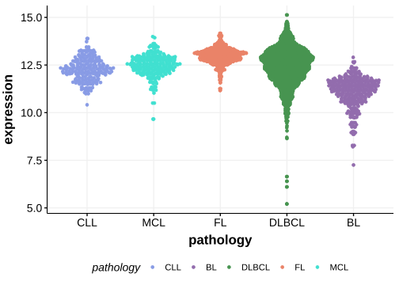

# IL16

## Overview

The IL16 gene, which encodes a pro-inflammatory cytokine, plays a role in immune responses. IL-16 is highly expressed in the activated B-cell-like (ABC) subtype of DLBCL compared to the germinal center B-cell-like (GCB) subtype. The role of mutations in lymphomagenesis is not understood. Overall, the mutation rate of IL16 is relatively low in DLBCL.

## Relevance tier by entity

[[include:tables/table1_IL16.md]]

## Mutation incidence in large patient cohorts (GAMBL reanalysis)

### DLBCL
[[include:tables/DLBCL_IL16]]

### BL
[[include:tables/BL_IL16]]

### FL
[[include:tables/FL_IL16]]

## Mutation pattern and selective pressure estimates

[[include:tables/dnds_IL16.md]]

[[include:tables/browser_IL16.md]]

## Expression

<!-- FLAGGED FOR TIER 2 -->

<!-- ORIGIN: Unknown -->

## References
