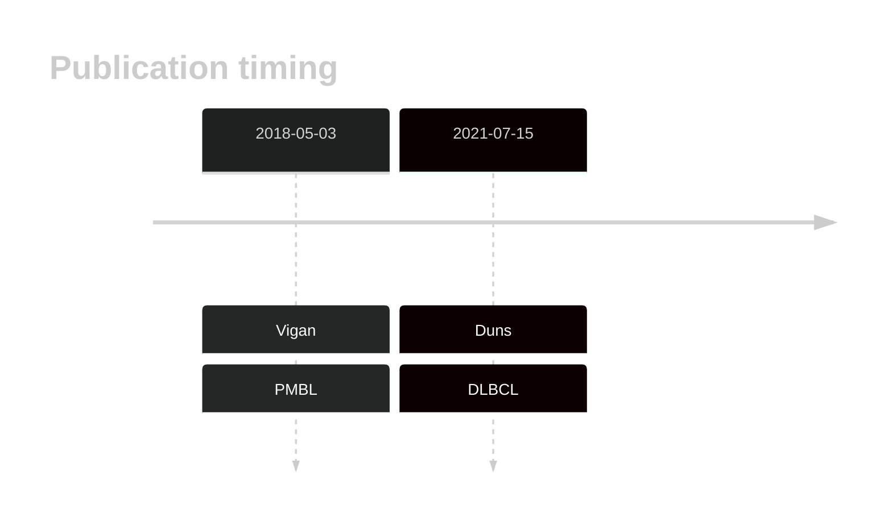
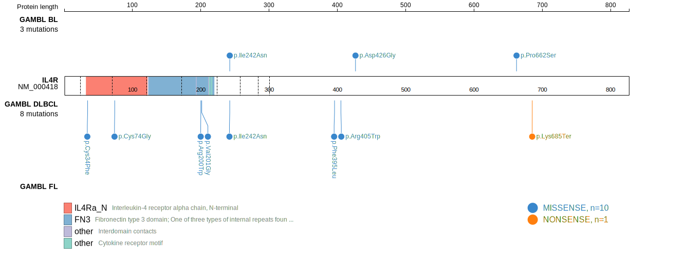
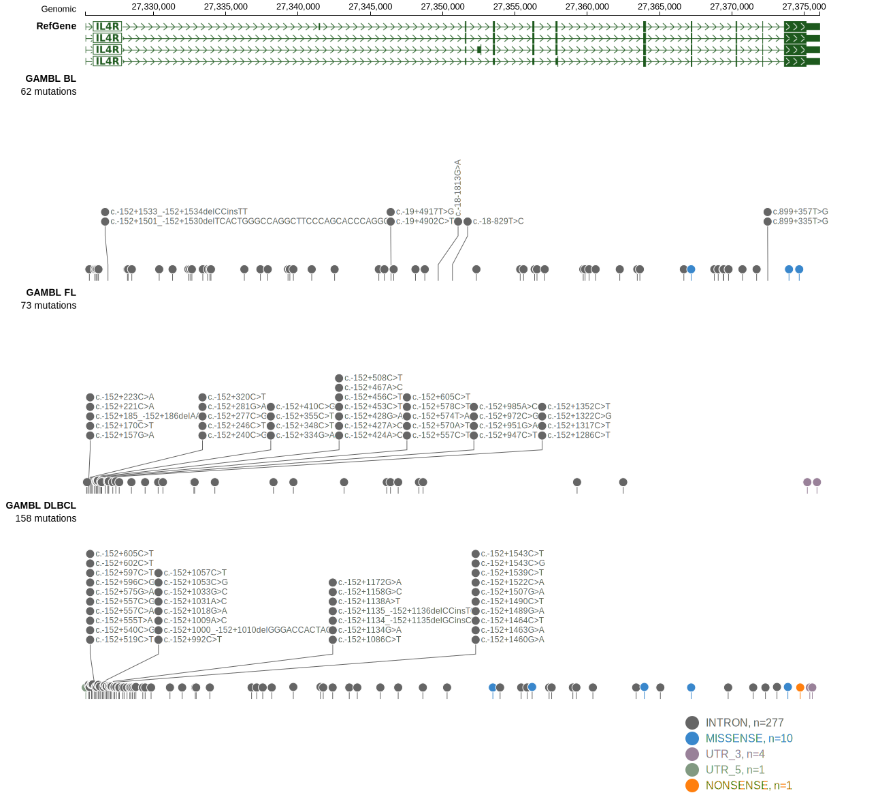

# IL4R

## Overview
Mutations in IL4R have been identified in various types of B-cell lymphomas, particularly primary mediastinal large B-cell lymphoma (PMBCL) and DLBCL. IL4R is one of [a number of genes](https://github.com/morinlab/LLMPP/wiki/ashm) affected by aberrant somatic hypermutation in B-cell lymphomas, which complicates the interpretation of mutations at this locus. IL4R mutations are found in approximately 24.2% of primary PMBCL cases. These mutations are commonly single nucleotide variants in exon 8, resulting in the I242N amino acid change. This leads to constitutive activation of the JAK-STAT signaling pathway and upregulation of downstream cytokine expression profiles and B cell-specific antigens.1,2 In DLBCL, IL4R mutations are more rare and tend to occur within the GCB subgroup.2 

## History

## Relevance tier by entity

|Entity|Tier|Description               |
|:------:|:----:|--------------------------|
||1|high-confidence PMBL/cHL/GZL gene|
| |1-a | aSHM target and high-confidence DLBCL gene|

## Mutation incidence in large patient cohorts (GAMBL reanalysis)

|Entity|source        |frequency (%)|
|:------:|:--------------:|:-------------:|
|DLBCL |GAMBL genomes |2.68         |
|DLBCL |Schmitz cohort|2.13         |
|DLBCL |Reddy cohort  |2.50         |
|DLBCL |Chapuy cohort |3.85         |

## Mutation pattern and selective pressure estimates

|Entity|aSHM|Significant selection|dN/dS (missense)|dN/dS (nonsense)|
|:------:|:----:|:---------------------:|:----------------:|:----------------:|
|BL    |Yes |No                   |3.355           |0               |
|DLBCL |Yes |No                   |9.640           |0               |
|FL    |Yes |No                   |0.000           |0               |

## aSHM regions

|chr_name|hg19_start|hg19_end|region                                                                                    |regulatory_comment|
|:--------:|:----------:|:--------:|:------------------------------------------------------------------------------------------:|:------------------:|
|chr16   |27322895  |27329423|[TSS](https://genome.ucsc.edu/s/rdmorin/GAMBL%20hg19?position=chr16%3A27322895%2D27329423)|active_promoter   |

## IL4R Hotspots

| Chromosome |Coordinate (hg19) | ref>alt | HGVSp | 
 | :---:| :---: | :--: | :---: |
| chr16 | 27367183 | T>A | I242N |

View coding variants in ProteinPaint [hg19](https://morinlab.github.io/LLMPP/GAMBL/IL4R_protein.html)  or [hg38](https://morinlab.github.io/LLMPP/GAMBL/IL4R_protein_hg38.html)

View all variants in GenomePaint [hg19](https://morinlab.github.io/LLMPP/GAMBL/IL4R.html)  or [hg38](https://morinlab.github.io/LLMPP/GAMBL/IL4R_hg38.html)

## References
1. *Gunawardana, J., Tol, T., Mak, K., Twa, D., Chavez, E., Woolcock, B., Kridel, R., Mottok, A., Healy, S., Telenius, A., Boyle, M., Ben-Neriah, S., Hung, S., Hother, C., Gascoyne, R., & Steidl, C. (2015). Abstract 3941: Recurrent IL4R mutations in primary mediastinal large B cell lymphoma. Cancer Research, 75, 3941-3941. https://doi.org/10.1158/1538-7445.AM2015-3941.* 
2. *Viganò E, Gunawardana J, Mottok A, Van Tol T, Mak K, Chan FC, Chong L, Chavez E, Woolcock B, Takata K, Twa D, Shulha HP, Telenius A, Kutovaya O, Hung SS, Healy S, Ben-Neriah S, Leroy K, Gaulard P, Diepstra A, Kridel R, Savage KJ, Rimsza L, Gascoyne R, Steidl C. Somatic IL4R mutations in primary mediastinal large B-cell lymphoma lead to constitutive JAK-STAT signaling activation. Blood. 2018 May 3;131(18):2036-2046. doi: 10.1182/blood-2017-09-808907. Epub 2018 Feb 21. PMID: 29467182.*
## IL4R Expression

<!-- ORIGIN: viganoSomaticIL4RMutations2018b -->
<!-- DLBCL: dunsCharacterizationDLBCLPMBL2021b -->
<!-- PMBL: viganoSomaticIL4RMutations2018b -->
