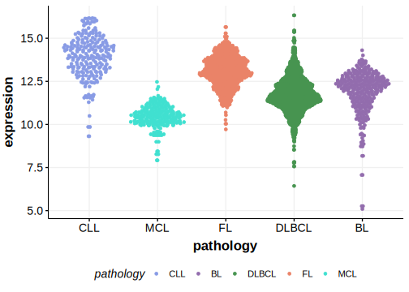

[[_TOC_]]

## Overview
Mutations in IL4R have been identified in various types of B-cell lymphomas, particularly primary mediastinal large B-cell lymphoma (PMBCL) and DLBCL. IL4R is one of [a number of genes](https://github.com/morinlab/LLMPP/wiki/ashm) affected by aberrant somatic hypermutation in B-cell lymphomas, which complicates the interpretation of mutations at this locus. IL4R mutations are found in approximately 24.2% of primary PMBCL cases. These mutations are commonly single nucleotide variants in exon 8, resulting in the I242N amino acid change. This leads to constitutive activation of the JAK-STAT signaling pathway and upregulation of downstream cytokine expression profiles and B cell-specific antigens.[@viganoSomaticIL4RMutations2018; @dunsCharacterizationDLBCLPMBL2021] In DLBCL, IL4R mutations are more rare and tend to occur within the GCB subgroup.[@dunsCharacterizationDLBCLPMBL2021]

## Experimental Evidence

Driver mutations affecting this gene in DLBCL have been experimentally demonstrated to cause a gain of function (GOF).[@viganoSomaticIL4RMutations2018]

## Relevance tier by entity

[[include:table1_IL4R.md]]

## Mutation incidence in large patient cohorts (GAMBL reanalysis)

### DLBCL
[[include:tables/DLBCL_IL4R.md]]

## Mutation pattern and selective pressure estimates

[[include:tables/dnds_IL4R.md]]

## aSHM regions

|chr_name|hg19_start|hg19_end|region                                                                                    |regulatory_comment|
|:--------:|:----------:|:--------:|:------------------------------------------------------------------------------------------:|:------------------:|
|chr16   |27322895  |27329423|[TSS](https://genome.ucsc.edu/s/rdmorin/GAMBL%20hg19?position=chr16%3A27322895%2D27329423)|active_promoter   |

## IL4R Hotspots

| Chromosome |Coordinate (hg19) | ref>alt | HGVSp | 
 | :---:| :---: | :--: | :---: |
| chr16 | 27367183 | T>A | I242N |

[[include:browser_IL4R.md]]

## Expression

<!-- ORIGIN: viganoSomaticIL4RMutations2018b -->
<!-- DLBCL: dunsCharacterizationDLBCLPMBL2021b -->
<!-- PMBL: viganoSomaticIL4RMutations2018b -->

[[include:tables/mermaid_IL4R.md]]

## References
