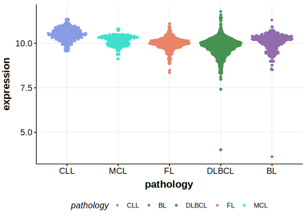

[[_TOC_]]

Mutations in this gene were first described in DLBCL in 2013[@zhangGeneticHeterogeneityDiffuse2013] and by the same group in a subsequent study.[@reddyGeneticFunctionalDrivers2017] It remains in Tier 2 because other exome and genome-wide studies of DLBCL did not reproduce this observation. 

## Relevance tier by entity

|Entity|Tier|Description                              |
|:------:|:----:|-----------------------------------------|
| |2   |relevance in DLBCL not firmly established[@zhangGeneticHeterogeneityDiffuse2013]|

## Mutation incidence in large patient cohorts (GAMBL reanalysis)

|Entity|source        |frequency (%)|
|:------:|:--------------:|:-------------:|
|DLBCL |GAMBL genomes |3.82         |
|DLBCL |Schmitz cohort|4.26         |
|DLBCL |Reddy cohort  |2.50         |
|DLBCL |Chapuy cohort |3.42         |

## Mutation pattern and selective pressure estimates

[[include:dnds_INO80.md]]

View coding variants in ProteinPaint [hg19](https://morinlab.github.io/LLMPP/GAMBL/INO80_protein.html)  or [hg38](https://morinlab.github.io/LLMPP/GAMBL/INO80_protein_hg38.html)

View all variants in GenomePaint [hg19](https://morinlab.github.io/LLMPP/GAMBL/INO80.html)  or [hg38](https://morinlab.github.io/LLMPP/GAMBL/INO80_hg38.html)

## INO80 Expression

<!-- ORIGIN: zhangGeneticHeterogeneityDiffuse2013 -->
<!-- DLBCL: zhangGeneticHeterogeneityDiffuse2013 -->

[[include:mermaid_INO80.md]]

## References
 
