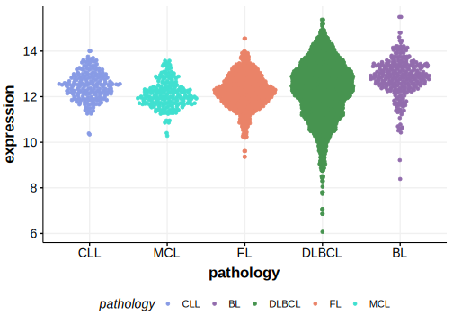

# IRAG2

## Relevance tier by entity

|Entity|Tier|Description                              |
|:------:|:----:|-----------------------------------------|
| |2   |relevance in DLBCL not firmly established|

## Mutation incidence in large patient cohorts (GAMBL reanalysis)

|Entity|source        |frequency (%)|
|:------:|:--------------:|:-------------:|
|DLBCL |GAMBL genomes |NA           |
|DLBCL |Schmitz cohort|NA           |
|DLBCL |Reddy cohort  |NA           |
|DLBCL |Chapuy cohort |NA           |

## Mutation pattern and selective pressure estimates

|

## IRAG2 Expression

<!-- ORIGIN: Unknown -->

## References
