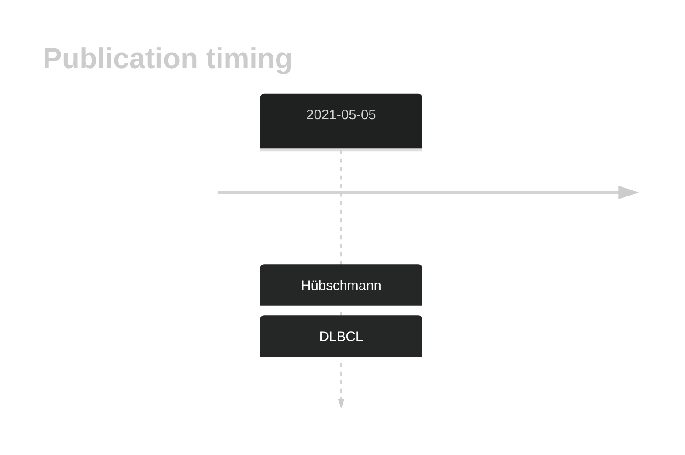
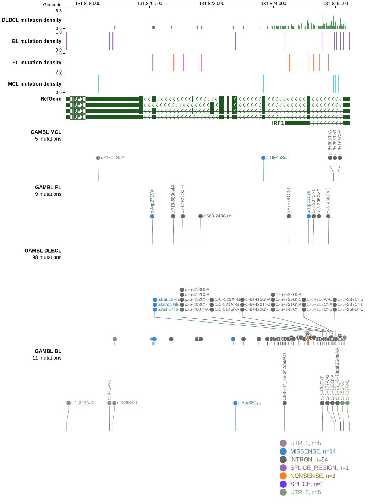
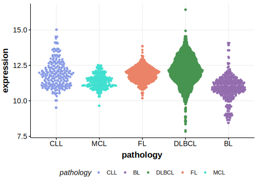

# IRF1

## History
Mutations in this gene were first described in DLBCL and FL in 2021 by Hübschmann et al.1

## Relevance tier by entity

|Entity|Tier|Description                              |
|:------:|:----:|-----------------------------------------|
| |2-a | aSHM target; Although recurrent, the relevance of mutations in DLBCL is tenuous [@hubschmannMutationalMechanismsShaping2021]|

## Mutation incidence in large patient cohorts (GAMBL reanalysis)

|Entity|source        |frequency (%)|
|:------:|:--------------:|:-------------:|
|DLBCL |GAMBL genomes |2.29         |
|DLBCL |Schmitz cohort|1.91         |
|DLBCL |Reddy cohort  |1.90         |
|DLBCL |Chapuy cohort |2.56         |

## Mutation pattern and selective pressure estimates

|Entity|aSHM|Significant selection|dN/dS (missense)|dN/dS (nonsense)|
|:------:|:----:|:---------------------:|:----------------:|:----------------:|
|BL    |Yes |No                   |2.409           | 0.000          |
|DLBCL |Yes |No                   |2.468           |39.294          |
|FL    |Yes |No                   |6.465           | 0.000          |

## aSHM regions

|chr_name|hg19_start|hg19_end |region                                                                                     |regulatory_comment|
|:--------:|:----------:|:---------:|:-------------------------------------------------------------------------------------------:|:------------------:|
|chr5    |131823933 |131826458|[TSS](https://genome.ucsc.edu/s/rdmorin/GAMBL%20hg19?position=chr5%3A131823933%2D131826458)|active_promoter   |

View coding variants in ProteinPaint [hg19](https://morinlab.github.io/LLMPP/GAMBL/IRF1_protein.html)  or [hg38](https://morinlab.github.io/LLMPP/GAMBL/IRF1_protein_hg38.html)

View all variants in GenomePaint [hg19](https://morinlab.github.io/LLMPP/GAMBL/IRF1.html)  or [hg38](https://morinlab.github.io/LLMPP/GAMBL/IRF1_hg38.html)

## IRF1 Expression

## All Mutations

[SP116697](https://www.bcgsc.ca/downloads/morinlab/GAMBL/MALY/SP116697.html)
[SP116606](https://www.bcgsc.ca/downloads/morinlab/GAMBL/MALY/SP116606.html)
[SP59304](https://www.bcgsc.ca/downloads/morinlab/GAMBL/MALY/SP59304.html)

## References

<!-- ORIGIN: hubschmannMutationalMechanismsShaping2021b -->
<!-- DLBCL: hubschmannMutationalMechanismsShaping2021b -->
