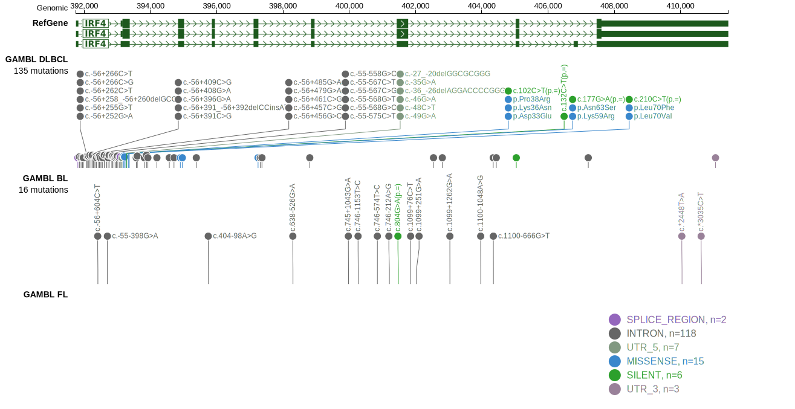

# IRF4
## Overview
IRF4 (Interferon Regulatory Factor 4) encodes a transcription factor that plays a critical role in the regulation of immune response genes and  B-cell development. Mutations and rearrangements in the IRF4 gene have been implicated in various B-cell lymphomas, including DLBCL. IRF4-rearranged large B-cell lymphomas (LBCL-IRF4) show a unique molecular profile with strong expression of IRF4/MUM1 and are associated with favorable outcomes. MUM1 staining is also commonly used to assign DLBCLs to one of the two cell-of-origin (COO) subgroups by immunohistochemistry.1 IRF4 is one of [a number of genes](https://github.com/morinlab/LLMPP/wiki/ashm) affected by aberrant somatic hypermutation in B-cell lymphomas, which complicates the interpretation of mutations at this locus. There are a few mutation hotspots in this gene. The functional role of mutations in IRF4 in the absence of a rearrangement remains poorly understood. 

## Relevance tier by entity

|Entity|Tier|Description               |
|:------:|:----:|--------------------------|
||2|relevance in PMBL/cHL/GZL not firmly established|
| |1-a | aSHM target and high-confidence DLBCL gene|
|    |1-a | aSHM target and high-confidence FL gene   |

## Mutation incidence in large patient cohorts (GAMBL reanalysis)

|Entity|source        |frequency (%)|
|:------:|:--------------:|:-------------:|
|DLBCL |GAMBL genomes |4.40         |
|DLBCL |Schmitz cohort|7.02         |
|DLBCL |Reddy cohort  |4.40         |
|DLBCL |Chapuy cohort |2.14         |
|FL    |GAMBL genomes |1.15         |

## Mutation pattern and selective pressure estimates

|Entity|aSHM|Significant selection|dN/dS (missense)|dN/dS (nonsense)|
|:------:|:----:|:---------------------:|:----------------:|:----------------:|
|BL    |Yes |No                   | 0.000          |0               |
|DLBCL |Yes |Yes                  |25.817          |0               |
|FL    |Yes |No                   | 0.000          |0               |

## aSHM regions

|chr_name|hg19_start|hg19_end|region                                                                               |regulatory_comment|
|:--------:|:----------:|:--------:|:-------------------------------------------------------------------------------------:|:------------------:|
|chr6    |390572    |394093  |[TSS](https://genome.ucsc.edu/s/rdmorin/GAMBL%20hg19?position=chr6%3A390572%2D394093)|active_promoter   |

> [!NOTE]
> First described in DLBCL in 2011 by [Morin RD](https://pubmed.ncbi.nlm.nih.gov/21796119)

 ## IRF4 Hotspots

| Chromosome |Coordinate (hg19) | ref>alt | HGVSp | 
 | :---:| :---: | :--: | :---: |
| chr6 | 393328 | A>G | K59R |
| chr6 | 393340 | A>G | N63S |
| chr6 | 393360 | C>G | L70V |
| chr6 | 393360 | C>T | L70F |

View coding variants in ProteinPaint [hg19](https://morinlab.github.io/LLMPP/GAMBL/IRF4_protein.html)  or [hg38](https://morinlab.github.io/LLMPP/GAMBL/IRF4_protein_hg38.html)

View all variants in GenomePaint [hg19](https://morinlab.github.io/LLMPP/GAMBL/IRF4.html)  or [hg38](https://morinlab.github.io/LLMPP/GAMBL/IRF4_hg38.html)

# IRF4 Expression

## References
1. *Hans CP, Weisenburger DD, Greiner TC, Gascoyne RD, Delabie J, Ott G, Müller-Hermelink HK, Campo E, Braziel RM, Jaffe ES, Pan Z, Farinha P, Smith LM, Falini B, Banham AH, Rosenwald A, Staudt LM, Connors JM, Armitage JO, Chan WC. Confirmation of the molecular classification of diffuse large B-cell lymphoma by immunohistochemistry using a tissue microarray. Blood. 2004 Jan 1;103(1):275-82. doi: 10.1182/blood-2003-05-1545. Epub 2003 Sep 22. PMID: 14504078.*
2. *Morin RD, Mendez-Lago M, Mungall AJ, Goya R, Mungall KL, Corbett RD, Johnson NA, Severson TM, Chiu R, Field M, Jackman S, Krzywinski M, Scott DW, Trinh DL, Tamura-Wells J, Li S, Firme MR, Rogic S, Griffith M, Chan S, Yakovenko O, Meyer IM, Zhao EY, Smailus D, Moksa M, Chittaranjan S, Rimsza L, Brooks-Wilson A, Spinelli JJ, Ben-Neriah S, Meissner B, Woolcock B, Boyle M, McDonald H, Tam A, Zhao Y, Delaney A, Zeng T, Tse K, Butterfield Y, Birol I, Holt R, Schein J, Horsman DE, Moore R, Jones SJ, Connors JM, Hirst M, Gascoyne RD, Marra MA. Frequent mutation of histone-modifying genes in non-Hodgkin lymphoma. Nature. 2011 Jul 27;476(7360):298-303. doi: 10.1038/nature10351. PMID: 21796119; PMCID: PMC3210554.*
<!-- ORIGIN: morinFrequentMutationHistonemodifying2011 -->
<!-- PMBL: mottokIntegrativeGenomicAnalysis2019b -->
<!-- DLBCL: morinFrequentMutationHistonemodifying2011 -->
