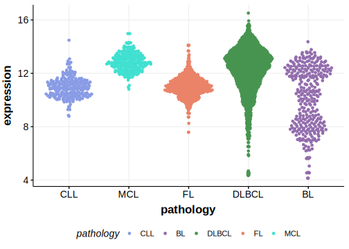

[[_TOC_]]

## Overview
IRF4 (Interferon Regulatory Factor 4) encodes a transcription factor that plays a critical role in the regulation of immune response genes and  B-cell development. Mutations and rearrangements in the IRF4 gene have been implicated in various B-cell lymphomas, including DLBCL. 
IRF4-rearranged large B-cell lymphomas (LBCL-IRF4) show a unique molecular profile with strong expression of IRF4/MUM1 and are associated with favorable outcomes. MUM1 staining is also commonly used to assign DLBCLs to one of the two cell-of-origin (COO) subgroups by immunohistochemistry. 
IRF4 is one of [a number of genes](https://github.com/morinlab/LLMPP/wiki/ashm) affected by aberrant somatic hypermutation in B-cell lymphomas, which complicates the interpretation of mutations at this locus. 
There are a few mutation hotspots in this gene. The functional role of mutations in IRF4 in the absence of a rearrangement remains poorly understood. 

## Relevance tier by entity

[[include:table1_IRF4.md]]

## Mutation incidence in large patient cohorts (GAMBL reanalysis)

### DLBCL
[[include:tables/DLBCL_IRF4.md]]

### FL
[[include:tables/FL_IRF4.md]]

## Mutation pattern and selective pressure estimates

[[include:tables/dnds_IRF4.md]]

## aSHM regions

|chr_name|hg19_start|hg19_end|region                                                                               |regulatory_comment|
|:--------:|:----------:|:--------:|:-------------------------------------------------------------------------------------:|:------------------:|
|chr6    |390572    |394093  |[TSS](https://genome.ucsc.edu/s/rdmorin/GAMBL%20hg19?position=chr6%3A390572%2D394093)|active_promoter   |

## IRF4 Hotspots

| Chromosome |Coordinate (hg19) | ref>alt | HGVSp | 
 | :---:| :---: | :--: | :---: |
| chr6 | 393328 | A>G | K59R |
| chr6 | 393340 | A>G | N63S |
| chr6 | 393360 | C>G | L70V |
| chr6 | 393360 | C>T | L70F |

[[include:browser_IRF4.md]]

## Expression

[[include:tables/mermaid_IRF4.md]]

## References

<!-- ORIGIN: morinFrequentMutationHistonemodifying2011 -->
<!-- PMBL: mottokIntegrativeGenomicAnalysis2019b -->
<!-- DLBCL: morinFrequentMutationHistonemodifying2011 -->
