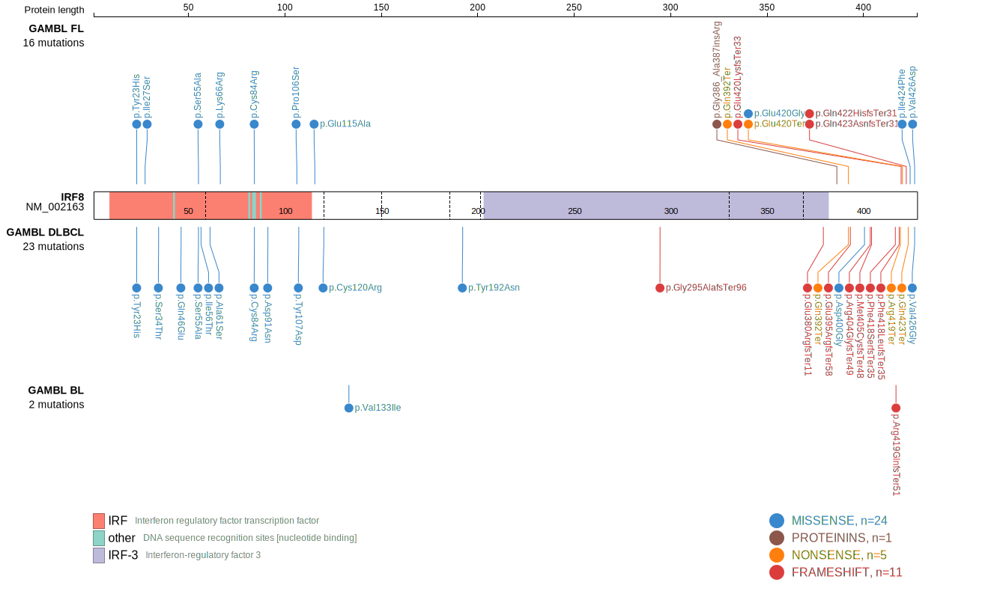
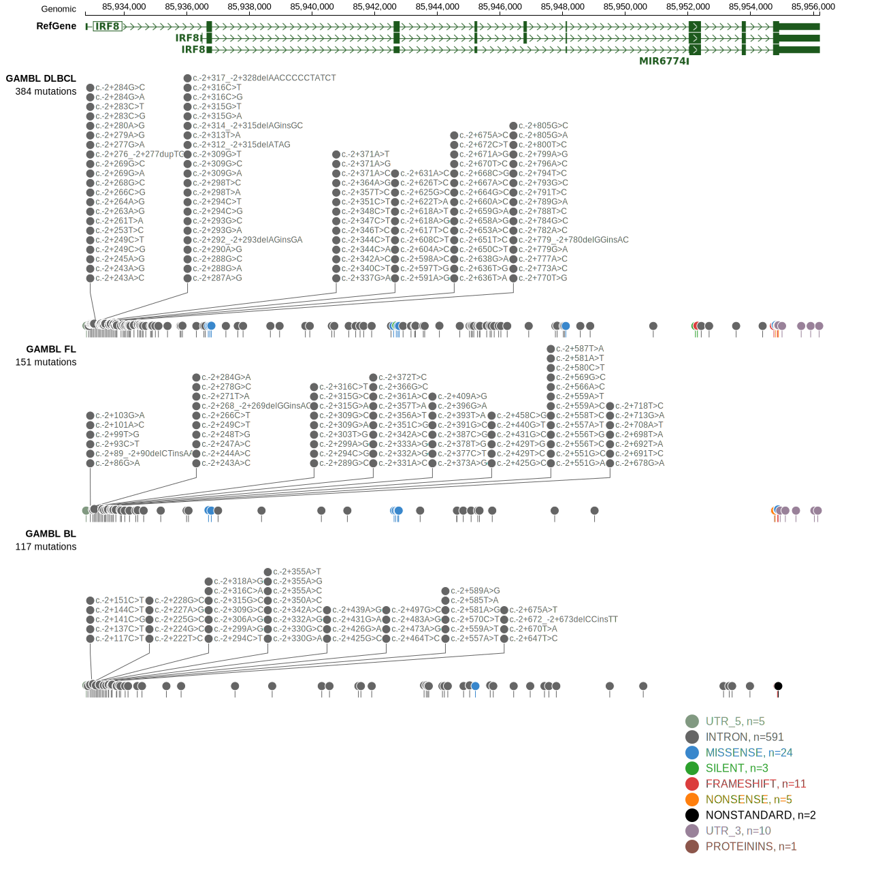

# IRF8 
## Overview
IRF8 (Interferon Regulatory Factor 8) is a transcription factor critical for the development and function of B lymphocytes. Mutations in IRF8 have been implicated in various lymphoid malignancies, most predominantly in FL and DLBCL. IRF8 is one of [a number of genes](https://github.com/morinlab/LLMPP/wiki/ashm) affected by aberrant somatic hypermutation in B-cell lymphomas, which complicates the interpretation of mutations at this locus. Coding and non-coding mutations in IRF8 are associated with the EZB subgroup of DLBCL.1 There is preliminary evidence that IRF8 mutations contribute to immune evasion by downregulating CD74 and HLA-DM in DLBCL.2  These are crucial for processing and presentation of self antigens.

## Relevance tier by entity

|Entity|Tier|Description                           |
|:------:|:----:|--------------------------------------|
|BL    |2-a | aSHM target; Although recurrent, the relevance of mutations in BL is tenuous |
|DLBCL |1-a | aSHM target and high-confidence DLBCL gene            |
|FL    |1-a | aSHM target and high-confidence FL gene               |

## Mutation incidence in large patient cohorts (GAMBL reanalysis)

|Entity|source               |frequency (%)|
|:------:|:---------------------:|:-------------:|
|BL    |GAMBL genomes+capture| 2.31        |
|BL    |Thomas cohort        | 1.30        |
|BL    |Panea cohort         | 6.90        |
|DLBCL |GAMBL genomes        | 8.03        |
|DLBCL |Schmitz cohort       |10.43        |
|DLBCL |Reddy cohort         | 7.61        |
|DLBCL |Chapuy cohort        |10.26        |
|FL    |GAMBL genomes        |12.01        |

## Mutation pattern and selective pressure estimates

|Entity|aSHM|Significant selection|dN/dS (missense)|dN/dS (nonsense)|
|:------:|:----:|:---------------------:|:----------------:|:----------------:|
|BL    |Yes |No                   | 1.360          |  0.000         |
|DLBCL |Yes |Yes                  | 6.806          |  0.000         |
|FL    |Yes |Yes                  |28.663          |102.572         |

## aSHM regions

|chr_name|hg19_start|hg19_end|region                                                                                    |regulatory_comment|
|:--------:|:----------:|:--------:|:------------------------------------------------------------------------------------------:|:------------------:|
|chr16   |85931918  |85933977|[TSS](https://genome.ucsc.edu/s/rdmorin/GAMBL%20hg19?position=chr16%3A85931918%2D85933977)|active_promoter   |

> [!NOTE]
> First described in DLBCL in 2011 by [Morin RD](https://pubmed.ncbi.nlm.nih.gov/21796119). First described in FL in 2011 by [Morin RD](https://pubmed.ncbi.nlm.nih.gov/21796119)

 ## IRF8 Hotspots

| Chromosome |Coordinate (hg19) | ref>alt | HGVSp | 
 | :---:| :---: | :--: | :---: |
| chr16 | 85936688 | T>C | Y23H |
| chr16 | 85936701 | T>G | I27S |
| chr16 | 85936784 | T>G | S55A |
| chr16 | 85936788 | T>C | I56T |
| chr16 | 85942602 | G>T | A61S |
| chr16 | 85942618 | A>G | K66R |
| chr16 | 85942671 | T>C | C84R |
| chr16 | 85942692 | G>A | D91N |

View coding variants in ProteinPaint [hg19](https://morinlab.github.io/LLMPP/GAMBL/IRF8_protein.html)  or [hg38](https://morinlab.github.io/LLMPP/GAMBL/IRF8_protein_hg38.html)

View all variants in GenomePaint [hg19](https://morinlab.github.io/LLMPP/GAMBL/IRF8.html)  or [hg38](https://morinlab.github.io/LLMPP/GAMBL/IRF8_hg38.html)

## References
1. *Wright GW, Huang DW, Phelan JD, Coulibaly ZA, Roulland S, Young RM, Wang JQ, Schmitz R, Morin RD, Tang J, Jiang A, Bagaev A, Plotnikova O, Kotlov N, Johnson CA, Wilson WH, Scott DW, Staudt LM. A Probabilistic Classification Tool for Genetic Subtypes of Diffuse Large B Cell Lymphoma with Therapeutic Implications. Cancer Cell. 2020 Apr 13;37(4):551-568.e14. doi: 10.1016/j.ccell.2020.03.015. PMID: 32289277; PMCID: PMC8459709.*
2. *Qiu Z, Khalife J, Lin AP, Ethiraj P, Jaafar C, Chiou L, Huelgas-Morales G, Aslam S, Arya S, Gupta YK, Dahia PLM, Aguiar RCT. IRF8-mutant B cell lymphoma evades immunity through a CD74-dependent deregulation of antigen processing and presentation in MHC CII complexes. bioRxiv [Preprint]. 2023 Oct 15:2023.10.14.560755. doi: 10.1101/2023.10.14.560755. PMID: 37873241; PMCID: PMC10592808.*
3. *Morin RD, Mendez-Lago M, Mungall AJ, Goya R, Mungall KL, Corbett RD, Johnson NA, Severson TM, Chiu R, Field M, Jackman S, Krzywinski M, Scott DW, Trinh DL, Tamura-Wells J, Li S, Firme MR, Rogic S, Griffith M, Chan S, Yakovenko O, Meyer IM, Zhao EY, Smailus D, Moksa M, Chittaranjan S, Rimsza L, Brooks-Wilson A, Spinelli JJ, Ben-Neriah S, Meissner B, Woolcock B, Boyle M, McDonald H, Tam A, Zhao Y, Delaney A, Zeng T, Tse K, Butterfield Y, Birol I, Holt R, Schein J, Horsman DE, Moore R, Jones SJ, Connors JM, Hirst M, Gascoyne RD, Marra MA. Frequent mutation of histone-modifying genes in non-Hodgkin lymphoma. Nature. 2011 Jul 27;476(7360):298-303. doi: 10.1038/nature10351. PMID: 21796119; PMCID: PMC3210554.*
## IRF8 Expression

<!-- ORIGIN: morinFrequentMutationHistonemodifying2011 -->
