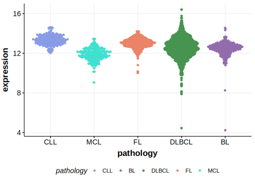

[[_TOC_]]

## Overview
IRF8 (Interferon Regulatory Factor 8) is a transcription factor critical for the development and function of B lymphocytes. Mutations in IRF8 have been implicated in various lymphoid malignancies, most predominantly in FL and DLBCL. 
IRF8 is one of [a number of genes](https://github.com/morinlab/LLMPP/wiki/ashm) affected by aberrant somatic hypermutation in B-cell lymphomas, which complicates the interpretation of mutations at this locus. 
Coding and non-coding mutations in IRF8 are associated with the EZB subgroup of DLBCL.
There is preliminary evidence that IRF8 mutations contribute to immune evasion by downregulating CD74 and HLA-DM in DLBCL.
These are crucial for processing and presentation of self antigens.

## Relevance tier by entity

[[include:table1_IRF8.md]]

## Mutation incidence in large patient cohorts (GAMBL reanalysis)

[[include:DLBCL_IRF8.md]]
[[include:FL_IRF8.md]]
[[include:BL_IRF8.md]]

## Mutation pattern and selective pressure estimates

[[include:dnds_IRF8.md]]

## aSHM regions

|chr_name|hg19_start|hg19_end|region                                                                                    |regulatory_comment|
|:--------:|:----------:|:--------:|:------------------------------------------------------------------------------------------:|:------------------:|
|chr16   |85931918  |85933977|[TSS](https://genome.ucsc.edu/s/rdmorin/GAMBL%20hg19?position=chr16%3A85931918%2D85933977)|active_promoter   |

## IRF8 Hotspots

| Chromosome |Coordinate (hg19) | ref>alt | HGVSp | 
 | :---:| :---: | :--: | :---: |
| chr16 | 85936688 | T>C | Y23H |
| chr16 | 85936701 | T>G | I27S |
| chr16 | 85936784 | T>G | S55A |
| chr16 | 85936788 | T>C | I56T |
| chr16 | 85942602 | G>T | A61S |
| chr16 | 85942618 | A>G | K66R |
| chr16 | 85942671 | T>C | C84R |
| chr16 | 85942692 | G>A | D91N |

[[include:browser_IRF8.md]]

## Expression

[[include:mermaid_IRF8.md]]

## References
[@wrightProbabilisticClassificationTool2020]
[@qiuIRF8mutantCellLymphoma2024]

<!-- ORIGIN: morinFrequentMutationHistonemodifying2011 -->
<!-- PMBL: mottokIntegrativeGenomicAnalysis2019b -->
<!-- FL: morinFrequentMutationHistonemodifying2011 -->
<!-- DLBCL: morinFrequentMutationHistonemodifying2011 -->
<!-- BL: paneaWholeGenomeLandscape2019 -->
