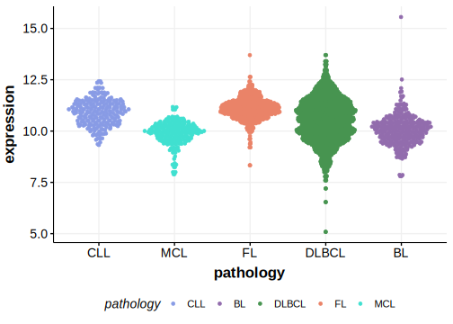

[[_TOC_]]

## Overview
The ITPKB gene encodes inositol-trisphosphate 3-kinase B, an enzyme involved in the regulation of intracellular calcium levels and PI3K/Akt signaling pathways. Mutations in ITPKB have been linked to various B-cell lymphomas, including DLBCL, PMBCL and, less commonly, FL.[@reichelFlowSortingExome2015;  @schmitzGeneticsPathogenesisDiffuse2018] ITPKB is one of [a number of genes](https://github.com/morinlab/LLMPP/wiki/ashm) affected by aberrant somatic hypermutation in B-cell lymphomas, which complicates the interpretation of mutations at this locus. These mutations are associated with the **BN2** genetic subgroup of DLBCL. The mutation pattern in ITPKB implies selection for loss-of-function mutations. 

## Experimental Evidence

Driver mutations affecting this gene in DLBCL have been experimentally demonstrated to cause a reduction or loss of function (LOF).[@tiacciPervasiveMutationsJAKSTAT2018]

## Relevance tier by entity

[[include:table1_ITPKB.md]]

## Mutation incidence in large patient cohorts (GAMBL reanalysis)

### DLBCL
[[include:DLBCL_ITPKB.md]]

### FL
[[include:FL_ITPKB.md]]

## Mutation pattern and selective pressure estimates

[[include:dnds_ITPKB.md]]

## aSHM regions

|chr_name|hg19_start|hg19_end |region                                                                                          |regulatory_comment|
|:--------:|:----------:|:---------:|:------------------------------------------------------------------------------------------------:|:------------------:|
|chr1    |226864857 |226873452|[intron](https://genome.ucsc.edu/s/rdmorin/GAMBL%20hg19?position=chr1%3A226864857%2D226873452)  |weak_enhancer     |
|chr1    |226920563 |226927885|[TSS](https://genome.ucsc.edu/s/rdmorin/GAMBL%20hg19?position=chr1%3A226920563%2D226927885)     |active_promoter   |
|chr1    |226921088 |226927982|[intron-1](https://genome.ucsc.edu/s/rdmorin/GAMBL%20hg19?position=chr1%3A226921088%2D226927982)|enhancer          |

## ITPKB Hotspots

| Chromosome |Coordinate (hg19) | ref>alt | HGVSp | 
 | :---:| :---: | :--: | :---: |
| chr1 | 226925148 | G>C | Y4* |
| chr1 | 226925148 | G>T | Y4* |

[[include:browser_ITPKB.md]]

## Expression

<!-- ORIGIN: reichelFlowSortingExome2015a -->
<!-- PMBL: reichelFlowSortingExome2015a -->
<!-- DLBCL: schmitzGeneticsPathogenesisDiffuse2018a -->

[[include:mermaid_ITPKB.md]]

## References

