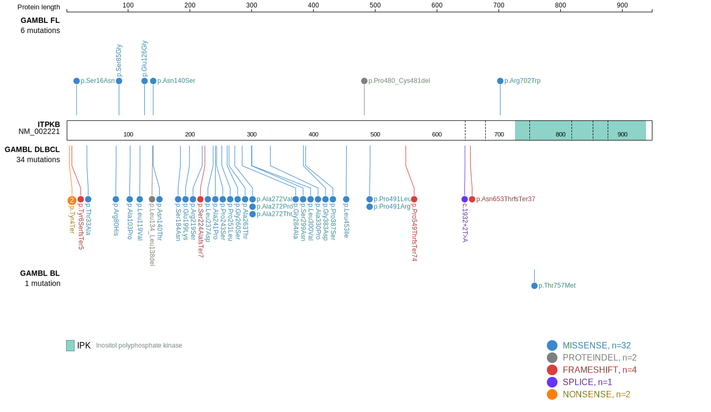

# ITPKB
## Overview
The ITPKB gene encodes inositol-trisphosphate 3-kinase B, an enzyme involved in the regulation of intracellular calcium levels and PI3K/Akt signaling pathways. Mutations in ITPKB have been linked to various B-cell lymphomas, including DLBCL, PMBCL and, less commonly, FL.1 ITPKB is one of [a number of genes](https://github.com/morinlab/LLMPP/wiki/ashm) affected by aberrant somatic hypermutation in B-cell lymphomas, which complicates the interpretation of mutations at this locus. These mutations are associated with the **BN2** genetic subgroup of DLBCL. The mutation pattern in ITPKB implies selection for loss-of-function mutations. 

## Relevance tier by entity

|Entity|Tier|Description               |
|:------:|:----:|--------------------------|
|DLBCL |1-a | aSHM target and high-confidence DLBCL gene|
|FL    |1-a | aSHM target and high-confidence FL gene   |

## Mutation incidence in large patient cohorts (GAMBL reanalysis)

|Entity|source        |frequency (%)|
|:------:|:--------------:|:-------------:|
|DLBCL |GAMBL genomes |6.69         |
|DLBCL |Schmitz cohort|6.81         |
|DLBCL |Reddy cohort  |6.71         |
|DLBCL |Chapuy cohort |9.40         |
|FL    |GAMBL genomes |3.23         |

## Mutation pattern and selective pressure estimates

|Entity|aSHM|Significant selection|dN/dS (missense)|dN/dS (nonsense)|
|:------:|:----:|:---------------------:|:----------------:|:----------------:|
|BL    |Yes |No                   |0.587           | 0.000          |
|DLBCL |Yes |Yes                  |4.294           |15.744          |
|FL    |Yes |No                   |6.541           | 0.000          |

## aSHM regions

|chr_name|hg19_start|hg19_end |region                                                                                          |regulatory_comment|
|:--------:|:----------:|:---------:|:------------------------------------------------------------------------------------------------:|:------------------:|
|chr1    |226864857 |226873452|[intron](https://genome.ucsc.edu/s/rdmorin/GAMBL%20hg19?position=chr1%3A226864857%2D226873452)  |weak_enhancer     |
|chr1    |226920563 |226927885|[TSS](https://genome.ucsc.edu/s/rdmorin/GAMBL%20hg19?position=chr1%3A226920563%2D226927885)     |active_promoter   |
|chr1    |226921088 |226927982|[intron-1](https://genome.ucsc.edu/s/rdmorin/GAMBL%20hg19?position=chr1%3A226921088%2D226927982)|enhancer          |

 ## ITPKB Hotspots

| Chromosome |Coordinate (hg19) | ref>alt | HGVSp | 
 | :---:| :---: | :--: | :---: |
| chr1 | 226925148 | G>C | Y4* |
| chr1 | 226925148 | G>T | Y4* |

View coding variants in ProteinPaint [hg19](https://morinlab.github.io/LLMPP/GAMBL/ITPKB_protein.html)  or [hg38](https://morinlab.github.io/LLMPP/GAMBL/ITPKB_protein_hg38.html)

View all variants in GenomePaint [hg19](https://morinlab.github.io/LLMPP/GAMBL/ITPKB.html)  or [hg38](https://morinlab.github.io/LLMPP/GAMBL/ITPKB_hg38.html)

## References
1. *Mareschal S, Dubois S, Viailly PJ, Bertrand P, Bohers E, Maingonnat C, Jaïs JP, Tesson B, Ruminy P, Peyrouze P, Copie-Bergman C, Fest T, Jo Molina T, Haioun C, Salles G, Tilly H, Lecroq T, Leroy K, Jardin F. Whole exome sequencing of relapsed/refractory patients expands the repertoire of somatic mutations in diffuse large B-cell lymphoma. Genes Chromosomes Cancer. 2016 Mar;55(3):251-67. doi: 10.1002/gcc.22328. Epub 2015 Nov 26. PMID: 26608593.*
## ITPKB Expression

