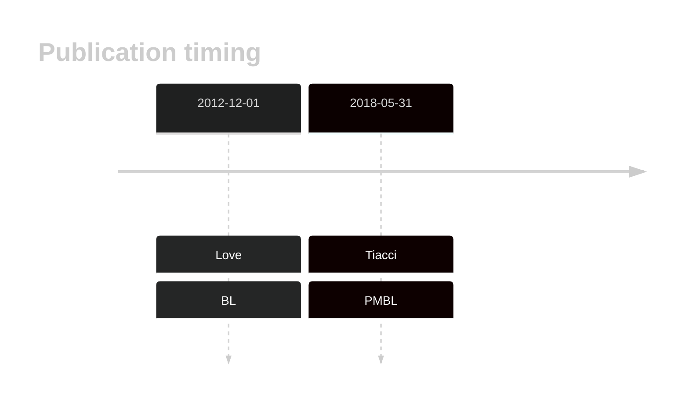
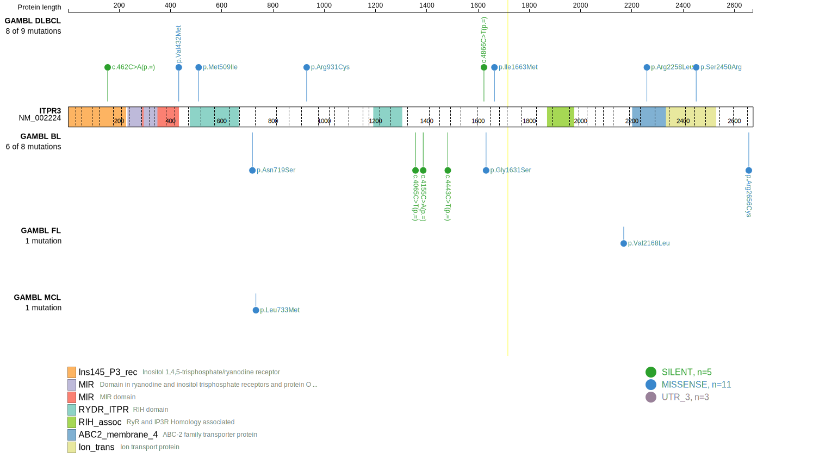
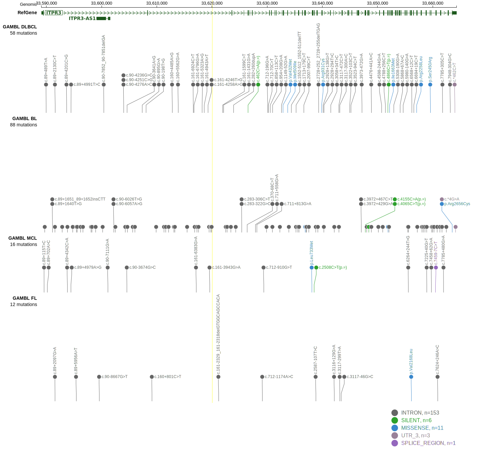

# ITPR3
## History

## Relevance tier by entity

|Entity|Tier|Description                           |
|:------:|:----:|--------------------------------------|
||2|relevance in PMBL/cHL/GZL not firmly established|
|    |2   |relevance in BL not firmly established|

## Mutation incidence in large patient cohorts (GAMBL reanalysis)

|Entity|source               |frequency (%)|
|:------:|:---------------------:|:-------------:|
|BL    |GAMBL genomes+capture|4.39         |
|BL    |Thomas cohort        |  NA         |
|BL    |Panea cohort         |  NA         |

## Mutation pattern and selective pressure estimates

|Entity|aSHM|Significant selection|dN/dS (missense)|dN/dS (nonsense)|
|:------:|:----:|:---------------------:|:----------------:|:----------------:|
|BL    |No  |No                   |0.546           |0               |
|DLBCL |No  |No                   |1.349           |0               |
|FL    |No  |No                   |1.332           |0               |

> [!NOTE]
> First described in BL in 2012 by [Love C](https://pubmed.ncbi.nlm.nih.gov/23143597)

View coding variants in ProteinPaint [hg19](https://morinlab.github.io/LLMPP/GAMBL/ITPR3_protein.html)  or [hg38](https://morinlab.github.io/LLMPP/GAMBL/ITPR3_protein_hg38.html)

View all variants in GenomePaint [hg19](https://morinlab.github.io/LLMPP/GAMBL/ITPR3.html)  or [hg38](https://morinlab.github.io/LLMPP/GAMBL/ITPR3_hg38.html)

## ITPR3 Expression

<!-- ORIGIN: loveGeneticLandscapeMutations2012 -->
<!-- BL: loveGeneticLandscapeMutations2012 -->
<!-- BL: loveGeneticLandscapeMutations2012 -->
## References
1.  Love C, Sun Z, Jima D, Li G, Zhang J, Miles R, Richards KL, Dunphy CH, Choi WWL, Srivastava G, Lugar PL, Rizzieri DA, Lagoo AS, Bernal-Mizrachi L, Mann KP, Flowers CR, Naresh KN, Evens AM, Chadburn A, Gordon LI, Czader MB, Gill JI, Hsi ED, Greenough A, Moffitt AB, McKinney M, Banerjee A, Grubor V, Levy S, Dunson DB, Dave SS. The genetic landscape of mutations in Burkitt lymphoma. Nat Genet. 2012 Dec;44(12):1321–1325. PMCID: PMC3674561
2.  Tiacci E, Ladewig E, Schiavoni G, Penson A, Fortini E, Pettirossi V, Wang Y, Rosseto A, Venanzi A, Vlasevska S, Pacini R, Piattoni S, Tabarrini A, Pucciarini A, Bigerna B, Santi A, Gianni AM, Viviani S, Cabras A, Ascani S, Crescenzi B, Mecucci C, Pasqualucci L, Rabadan R, Falini B. Pervasive mutations of JAK-STAT pathway genes in classical Hodgkin lymphoma. Blood. 2018 May 31;131(22):2454–2465. PMCID: PMC6634958
