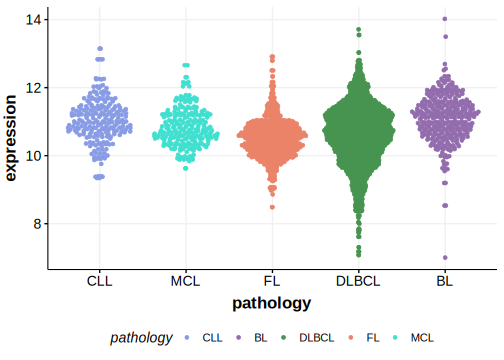

[[_TOC_]]

## Relevance tier by entity

[[include:table1_ITPR3.md]]

## Warnings

<<Warn("The variants reported in this gene failed QC")>>

## Mutation incidence in large patient cohorts (GAMBL reanalysis)

|Entity|source               |frequency (%)|
|:------:|:---------------------:|:-------------:|
|BL    |GAMBL genomes+capture|4.39         |
|BL    |Thomas cohort        |  NA         |
|BL    |Panea cohort         |  NA         |

## Mutation pattern and selective pressure estimates

[[include:tables/dnds_ITPR3.md]]

[[include:browser_ITPR3.md]]

## Expression

## Representative Mutations

**Rating**
&starf; &star; &star; &star; &star;

## All Mutations

[1061](https://www.bcgsc.ca/downloads/morinlab/GAMBL/Love/1061_reports.html)
[1065](https://www.bcgsc.ca/downloads/morinlab/GAMBL/Love/1065_reports.html)
[742](https://www.bcgsc.ca/downloads/morinlab/GAMBL/Love/742_reports.html)

[[include:tables/mermaid_ITPR3.md]]

## References

<!-- ORIGIN: loveGeneticLandscapeMutations2012 -->
<!-- BL: loveGeneticLandscapeMutations2012 -->
<!-- PMBL: tiacciPervasiveMutationsJAKSTAT2018b -->
