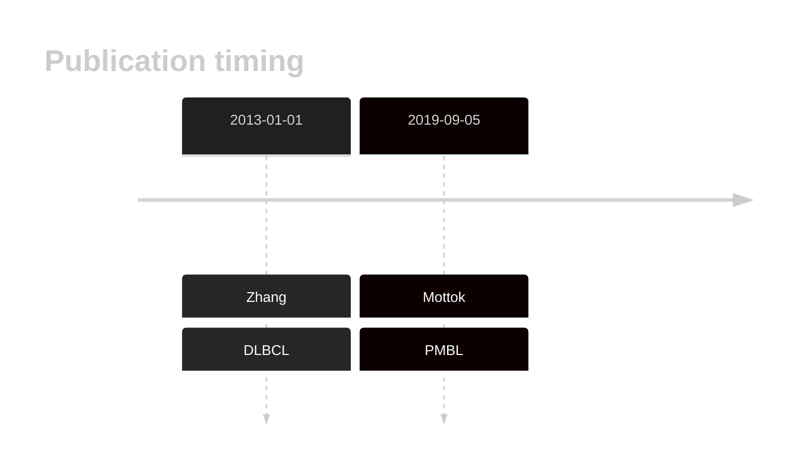

# JAK1

## History

## Relevance tier by entity

|Entity|Tier|Description                              |
|:------:|:----:|-----------------------------------------|
||1|high-confidence PMBL/cHL/GZL gene|
| |2   |relevance in DLBCL not firmly established|

## Mutation incidence in large patient cohorts (GAMBL reanalysis)

|Entity|source        |frequency (%)|
|:------:|:--------------:|:-------------:|
|DLBCL |GAMBL genomes |2.49         |
|DLBCL |Schmitz cohort|1.91         |
|DLBCL |Reddy cohort  |2.20         |
|DLBCL |Chapuy cohort |2.14         |

## Mutation pattern and selective pressure estimates

|Entity|aSHM|Significant selection|dN/dS (missense)|dN/dS (nonsense)|
|:------:|:----:|:---------------------:|:----------------:|:----------------:|
|BL    |No  |No                   |1.067           |0               |
|DLBCL |No  |No                   |4.294           |0               |
|FL    |No  |No                   |0.000           |0               |

 ## JAK1 Hotspots

| Chromosome |Coordinate (hg19) | ref>alt | HGVSp | 
 | :---:| :---: | :--: | :---: |
| chr1 | 65301158 | C>A | G1097V |

View coding variants in ProteinPaint [hg19](https://morinlab.github.io/LLMPP/GAMBL/JAK1_protein.html)  or [hg38](https://morinlab.github.io/LLMPP/GAMBL/JAK1_protein_hg38.html)

View all variants in GenomePaint [hg19](https://morinlab.github.io/LLMPP/GAMBL/JAK1.html)  or [hg38](https://morinlab.github.io/LLMPP/GAMBL/JAK1_hg38.html)

## JAK1 Expression

<!-- ORIGIN: zhangGeneticHeterogeneityDiffuse2013 -->
<!-- DLBCL: zhangGeneticHeterogeneityDiffuse2013 -->
<!-- PMBL: mottokIntegrativeGenomicAnalysis2019b -->

## References
1.  Zhang J, Grubor V, Love CL, Banerjee A, Richards KL, Mieczkowski PA, Dunphy C, Choi W, Au WY, Srivastava G, Lugar PL, Rizzieri DA, Lagoo AS, Bernal-Mizrachi L, Mann KP, Flowers C, Naresh K, Evens A, Gordon LI, Czader M, Gill JI, Hsi ED, Liu Q, Fan A, Walsh K, Jima D, Smith LL, Johnson AJ, Byrd JC, Luftig MA, Ni T, Zhu J, Chadburn A, Levy S, Dunson D, Dave SS. Genetic heterogeneity of diffuse large B-cell lymphoma. 2013 Jan; 
2.  Mottok A, Hung SS, Chavez EA, Woolcock B, Telenius A, Chong LC, Meissner B, Nakamura H, Rushton C, Viganò E, Sarkozy C, Gascoyne RD, Connors JM, Ben-Neriah S, Mungall A, Marra MA, Siebert R, Scott DW, Savage KJ, Steidl C. Integrative genomic analysis identifies key pathogenic mechanisms in primary mediastinal large B-cell lymphoma. Blood. 2019 Sep 5;134(10):802–813. PMID: 31292115
