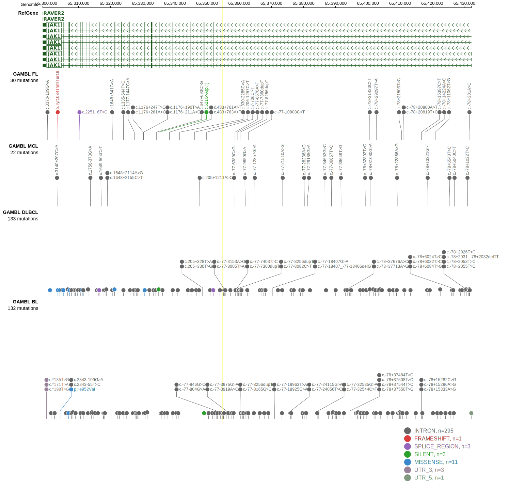

# JAK1

## Relevance tier by entity

|Entity|Tier|Description                              |
|:------:|:----:|-----------------------------------------|
||1|high-confidence PMBL/cHL/GZL gene|
| |2   |relevance in DLBCL not firmly established|

## Mutation incidence in large patient cohorts (GAMBL reanalysis)

|Entity|source        |frequency (%)|
|:------:|:--------------:|:-------------:|
|DLBCL |GAMBL genomes |2.49         |
|DLBCL |Schmitz cohort|1.91         |
|DLBCL |Reddy cohort  |2.20         |
|DLBCL |Chapuy cohort |2.14         |

## Mutation pattern and selective pressure estimates

|Entity|aSHM|Significant selection|dN/dS (missense)|dN/dS (nonsense)|
|:------:|:----:|:---------------------:|:----------------:|:----------------:|
|BL    |No  |No                   |1.067           |0               |
|DLBCL |No  |No                   |4.294           |0               |
|FL    |No  |No                   |0.000           |0               |

> [!NOTE]
> First described in DLBCL in 2013 by [Zhang J](https://pubmed.ncbi.nlm.nih.gov/23292937)

 ## JAK1 Hotspots

| Chromosome |Coordinate (hg19) | ref>alt | HGVSp | 
 | :---:| :---: | :--: | :---: |
| chr1 | 65301158 | C>A | G1097V |

View coding variants in ProteinPaint [hg19](https://morinlab.github.io/LLMPP/GAMBL/JAK1_protein.html)  or [hg38](https://morinlab.github.io/LLMPP/GAMBL/JAK1_protein_hg38.html)

View all variants in GenomePaint [hg19](https://morinlab.github.io/LLMPP/GAMBL/JAK1.html)  or [hg38](https://morinlab.github.io/LLMPP/GAMBL/JAK1_hg38.html)

## JAK1 Expression

<!-- ORIGIN: zhangGeneticHeterogeneityDiffuse2013 -->
<!-- DLBCL: zhangGeneticHeterogeneityDiffuse2013 -->
<!-- PMBL: mottokIntegrativeGenomicAnalysis2019b -->
