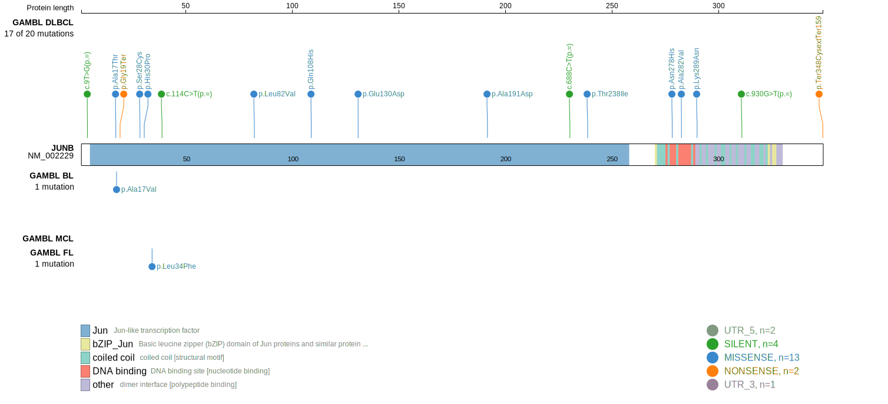
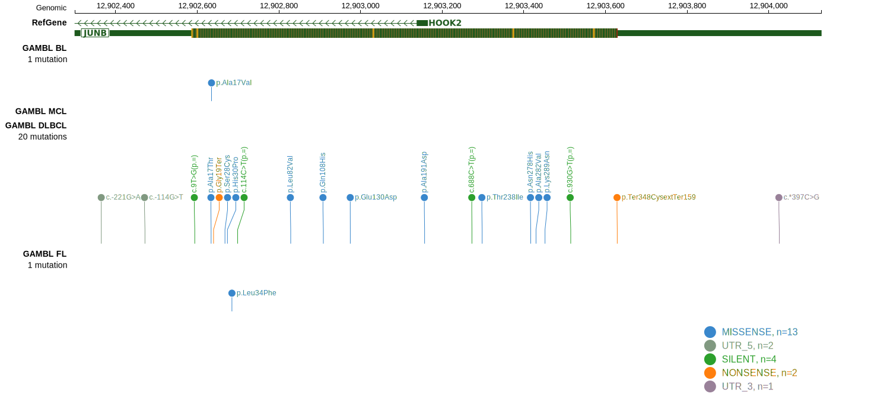
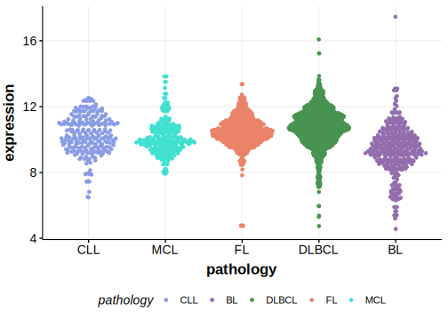

# JUNB
## Overview
JUNB has been reported to be frequently mutated in T-cell/histiocyte-rich large B-cell lymphoma (THRLBCL).1 Mutations have also been reported in DLBCL but the mutation rate in the earliest study2 was likely an over-estimate.3 According to one study, mutations are often enriched at somatic hypermutation hotspot sites, indicating the involvement of aberrant somatic hypermutation in the pathogenesis of these lymphomas.1

## Relevance tier by entity

|Entity|Tier|Description               |
|:------:|:----:|--------------------------|
|DLBCL |1   |high-confidence DLBCL gene|

## Mutation incidence in large patient cohorts (GAMBL reanalysis)

|Entity|source        |frequency (%)|
|:------:|:--------------:|:-------------:|
|DLBCL |GAMBL genomes |3.25         |
|DLBCL |Schmitz cohort|3.19         |
|DLBCL |Reddy cohort  |3.50         |
|DLBCL |Chapuy cohort |2.14         |

## Mutation pattern and selective pressure estimates

|Entity|aSHM|Significant selection|dN/dS (missense)|dN/dS (nonsense)|
|:------:|:----:|:---------------------:|:----------------:|:----------------:|
|BL    |No  |No                   |1.009           |0.00            |
|DLBCL |No  |No                   |1.285           |8.88            |
|FL    |No  |No                   |0.000           |0.00            |

> [!NOTE]
> First described in DLBCL in 2017 by [Reddy A](https://pubmed.ncbi.nlm.nih.gov/28985567)

> [!WARNING]
> Mutations in this gene were reported to be inflated in the original results according to [Dreval K](https://www.biorxiv.org/content/10.1101/2023.11.21.567983v1)

View coding variants in ProteinPaint [hg19](https://morinlab.github.io/LLMPP/GAMBL/JUNB_protein.html)  or [hg38](https://morinlab.github.io/LLMPP/GAMBL/JUNB_protein_hg38.html)

View all variants in GenomePaint [hg19](https://morinlab.github.io/LLMPP/GAMBL/JUNB.html)  or [hg38](https://morinlab.github.io/LLMPP/GAMBL/JUNB_hg38.html)

## References
1. *Schuhmacher, B., Bein, J., Rausch, T., Beneš, V., Tousseyn, T., Vornanen, M., Ponzoni, M., Thurner, L., Gascoyne, R., Steidl, C., Küppers, R., Hansmann, M., & Hartmann, S. (2018). JUNB, DUSP2, SGK1, SOCS1 and CREBBP are frequently mutated in T-cell/histiocyte-rich large B-cell lymphoma. Haematologica, 104, 330 - 337. https://doi.org/10.3324/haematol.2018.203224.*
2. *Reddy A, Zhang J, Davis NS, Moffitt AB, Love CL, Waldrop A, Leppa S, Pasanen A, Meriranta L, Karjalainen-Lindsberg ML, Nørgaard P, Pedersen M, Gang AO, Høgdall E, Heavican TB, Lone W, Iqbal J, Qin Q, Li G, Kim SY, Healy J, Richards KL, Fedoriw Y, Bernal-Mizrachi L, Koff JL, Staton AD, Flowers CR, Paltiel O, Goldschmidt N, Calaminici M, Clear A, Gribben J, Nguyen E, Czader MB, Ondrejka SL, Collie A, Hsi ED, Tse E, Au-Yeung RKH, Kwong YL, Srivastava G, Choi WWL, Evens AM, Pilichowska M, Sengar M, Reddy N, Li S, Chadburn A, Gordon LI, Jaffe ES, Levy S, Rempel R, Tzeng T, Happ LE, Dave T, Rajagopalan D, Datta J, Dunson DB, Dave SS. Genetic and Functional Drivers of Diffuse Large B Cell Lymphoma. Cell. 2017 Oct 5;171(2):481-494.e15. doi: 10.1016/j.cell.2017.09.027. PMID: 28985567; PMCID: PMC5659841.*
3. *Revisiting Reddy: A DLBCL Do-over
Kostiantyn Dreval, Manuela Cruz, Christopher Rushton, Nina Liuta, Houman Layegh Mirhosseini, Callum Brown, Ryan D. Morin, the GAMBL consortium
bioRxiv 2023.11.21.567983; doi: https://doi.org/10.1101/2023.11.21.567983*
## JUNB Expression

