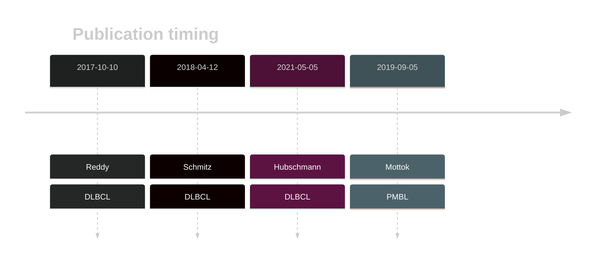

# JUNB

## Overview
JUNB has been reported to be frequently mutated in T-cell/histiocyte-rich large B-cell lymphoma (THRLBCL).[@schuhmacherJUNBDUSP2SGK12019] Mutations have also been reported in DLBCL but the mutation rate in the earliest study[@reddyGeneticFunctionalDrivers2017] was likely an over-estimate.[@drevalRevisitingReddyDLBCL2023] According to one study, mutations are often enriched at somatic hypermutation hotspot sites, indicating the involvement of aberrant somatic hypermutation in the pathogenesis of these lymphomas.[@schuhmacherJUNBDUSP2SGK12019]

## History

## Relevance tier by entity

|Entity|Tier|Description               |
|:------:|:----:|--------------------------|
||2|relevance in PMBL/cHL/GZL not firmly established[@mottokIntegrativeGenomicAnalysis2019]|
| |1   |high-confidence DLBCL gene[@reddyGeneticFunctionalDrivers2017; @hubschmannMutationalMechanismsShaping2021]|

## Mutation incidence in large patient cohorts (GAMBL reanalysis)

[[include:DLBCL_JUNB.md]]

## Mutation pattern and selective pressure estimates

[[include:dnds_JUNB.md]]

> [!WARNING]
> Mutations in this gene were reported to be inflated in the original results according to [Dreval K](https://www.biorxiv.org/content/10.1101/2023.11.21.567983v1)

View coding variants in ProteinPaint [hg19](https://morinlab.github.io/LLMPP/GAMBL/JUNB_protein.html)  or [hg38](https://morinlab.github.io/LLMPP/GAMBL/JUNB_protein_hg38.html)

View all variants in GenomePaint [hg19](https://morinlab.github.io/LLMPP/GAMBL/JUNB.html)  or [hg38](https://morinlab.github.io/LLMPP/GAMBL/JUNB_hg38.html)

## JUNB Expression

<!-- ORIGIN: reddyGeneticFunctionalDrivers2017 -->
<!-- DLBCL: reddyGeneticFunctionalDrivers2017 -->
<!-- PMBL: mottokIntegrativeGenomicAnalysis2019b -->

## References

