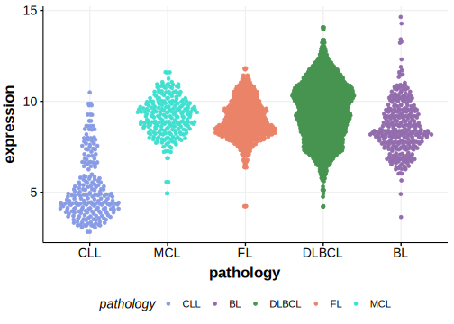

[[_TOC_]]

## Overview

Mutations in this gene were first described in FL in 2021 by Hübschmann et al.[@hubschmannMutationalMechanismsShaping2021]

## Relevance tier by entity

[[include:table1_JUP.md]]

## Mutation incidence in large patient cohorts (GAMBL reanalysis)

|Entity|source       |frequency (%)|
|:------:|:-------------:|:-------------:|
|FL    |GAMBL genomes|1.15         |

## Mutation pattern and selective pressure estimates

[[include:dnds_JUP.md]]

[[include:browser_JUP.md]]

## Expression

## All Mutations

[SP193229](https://www.bcgsc.ca/downloads/morinlab/GAMBL/MALY/SP193229.html)
[SP193801](https://www.bcgsc.ca/downloads/morinlab/GAMBL/MALY/SP193801.html)
[SP59448](https://www.bcgsc.ca/downloads/morinlab/GAMBL/MALY/SP59448.html)

[[include:mermaid_JUP.md]]

## References

<!-- ORIGIN: hubschmannMutationalMechanismsShaping2021b -->
<!-- FL: hubschmannMutationalMechanismsShaping2021b -->
