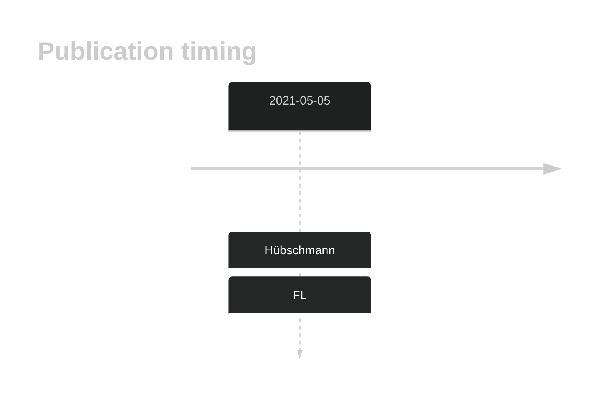

# JUP

## History
Mutations in this gene were first described in FL in 2021 by Hübschmann et al.1

## Relevance tier by entity

|Entity|Tier|Description                           |
|:------:|:----:|--------------------------------------|
|    |2   |relevance in FL not firmly established[@hubschmannMutationalMechanismsShaping2021]|

## Mutation incidence in large patient cohorts (GAMBL reanalysis)

|Entity|source       |frequency (%)|
|:------:|:-------------:|:-------------:|
|FL    |GAMBL genomes|1.15         |

## Mutation pattern and selective pressure estimates

|Entity|aSHM|Significant selection|dN/dS (missense)|dN/dS (nonsense)|
|:------:|:----:|:---------------------:|:----------------:|:----------------:|
|BL    |No  |No                   |1.441           |8.462           |
|DLBCL |No  |No                   |4.770           |0.000           |
|FL    |No  |No                   |8.023           |0.000           |

View coding variants in ProteinPaint [hg19](https://morinlab.github.io/LLMPP/GAMBL/JUP_protein.html)  or [hg38](https://morinlab.github.io/LLMPP/GAMBL/JUP_protein_hg38.html)

View all variants in GenomePaint [hg19](https://morinlab.github.io/LLMPP/GAMBL/JUP.html)  or [hg38](https://morinlab.github.io/LLMPP/GAMBL/JUP_hg38.html)

## JUP Expression

## All Mutations

[SP193229](https://www.bcgsc.ca/downloads/morinlab/GAMBL/MALY/SP193229.html)
[SP193801](https://www.bcgsc.ca/downloads/morinlab/GAMBL/MALY/SP193801.html)
[SP59448](https://www.bcgsc.ca/downloads/morinlab/GAMBL/MALY/SP59448.html)

## References

<!-- ORIGIN: hubschmannMutationalMechanismsShaping2021b -->
<!-- FL: hubschmannMutationalMechanismsShaping2021b -->
