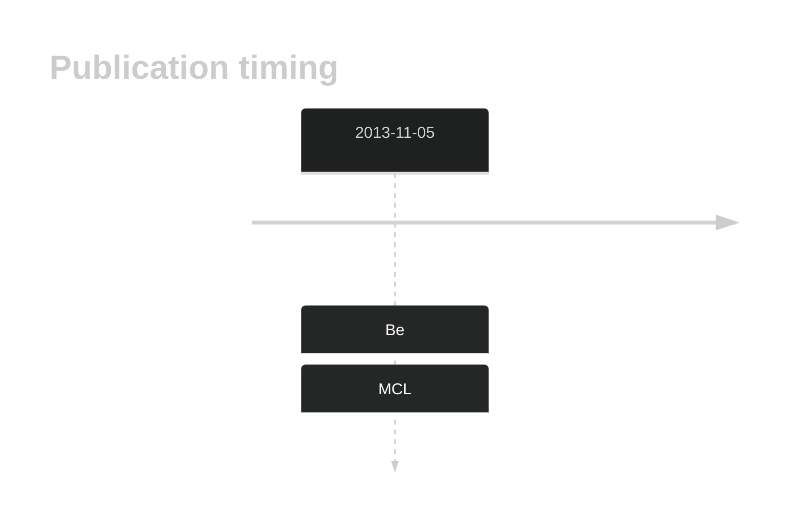

# KIAA1671

## History

## Relevance tier by entity

|Entity|Tier|Description|
|:------:|:----:|--------------------------------------|
||2|relevance in MCL not firmly established[@beaLandscapeSomaticMutations2013]|

## Mutation incidence in large patient cohorts (GAMBL reanalysis)

|Entity|source |frequency (%)|
|:------:|:----:|:----:|
|BL|GAMBL Exome |24.138 |
|BL|GAMBL Genome |11.969 |
|DLBCL|GAMBL Exome |8.895 |
|DLBCL|GAMBL Genome |0.188 |
|MCL|GAMBL Genome |4.678 |

## References

