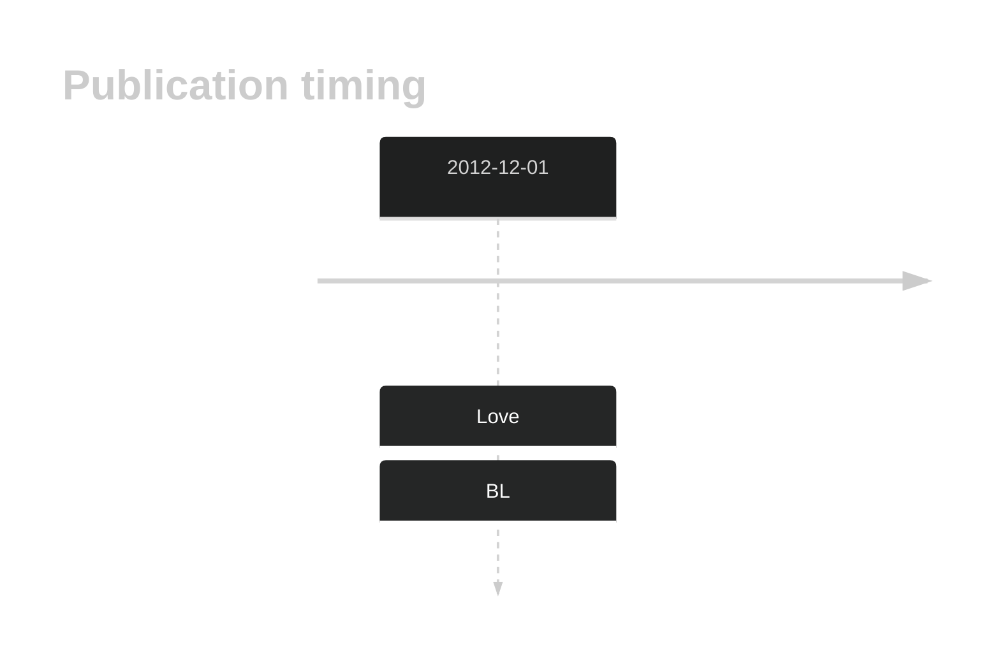
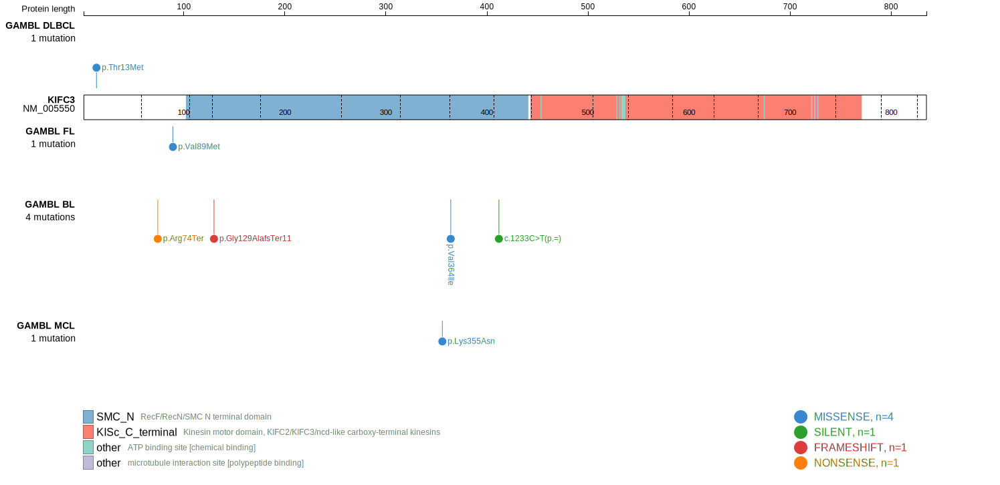
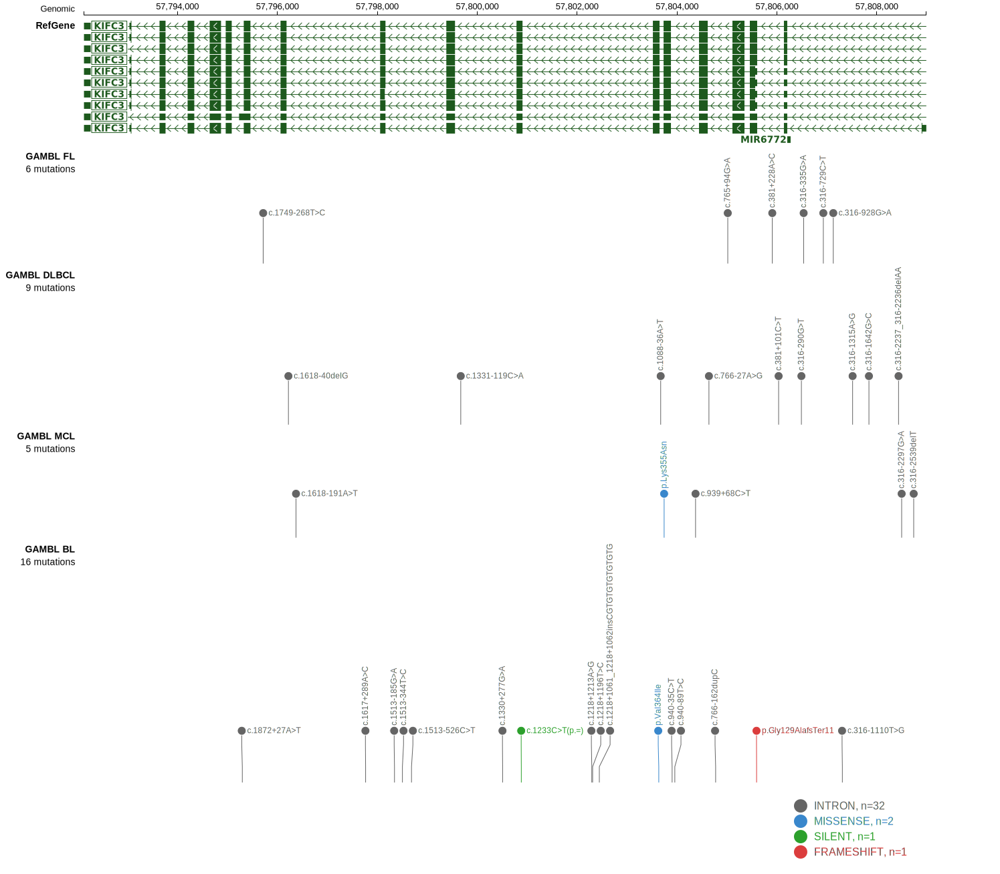
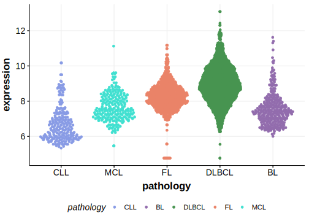
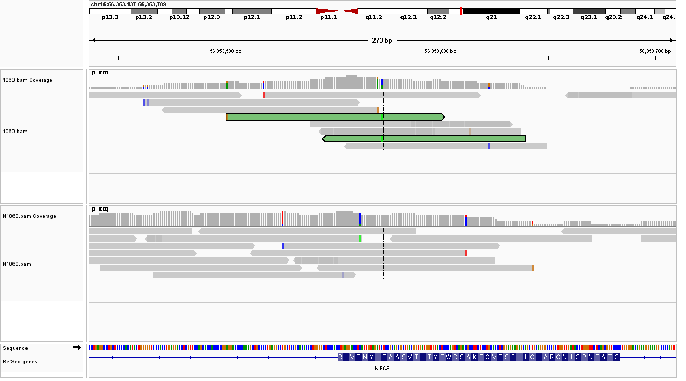

# KIFC3

Due to [minimal support](KIFC3#representative-mutations) in the original primary data, [low expression in BL](KIFC3#kifc3-expression) and very few mutations reported in subsequent studies, this gene is very unlikely to be relevant in BL. 

<<Warn("The variants reported in this gene failed QC")>>

## History

## Relevance tier by entity

|Entity|Tier|Description                           |
|:------:|:----:|--------------------------------------|
|    |2-F   |Failed QC[@loveGeneticLandscapeMutations2012]|

## Mutation incidence in large patient cohorts (GAMBL reanalysis)

|Entity|source               |frequency (%)|
|:------:|:---------------------:|:-------------:|
|BL    |GAMBL genomes+capture|1.62         |
|BL    |Thomas cohort        |  NA         |
|BL    |Panea cohort         |  NA         |

## Mutation pattern and selective pressure estimates

|Entity|aSHM|Significant selection|dN/dS (missense)|dN/dS (nonsense)|
|:------:|:----:|:---------------------:|:----------------:|:----------------:|
|BL    |No  |No                   |1.012           |5.98            |
|DLBCL |No  |No                   |0.000           |0.00            |
|FL    |No  |No                   |2.064           |0.00            |

View coding variants in ProteinPaint [hg19](https://morinlab.github.io/LLMPP/GAMBL/KIFC3_protein.html)  or [hg38](https://morinlab.github.io/LLMPP/GAMBL/KIFC3_protein_hg38.html)

View all variants in GenomePaint [hg19](https://morinlab.github.io/LLMPP/GAMBL/KIFC3.html)  or [hg38](https://morinlab.github.io/LLMPP/GAMBL/KIFC3_hg38.html)

## KIFC3 Expression

<!-- ORIGIN: loveGeneticLandscapeMutations2012 -->
<!-- BL: loveGeneticLandscapeMutations2012 -->

## Representative Mutations

**Rating**
&starf; &star; &star; &star; &star;

**Rating**
&starf; &star; &star; &star; &star;

## All Mutations

[1060](https://www.bcgsc.ca/downloads/morinlab/GAMBL/Love/1060_reports.html)

## References

