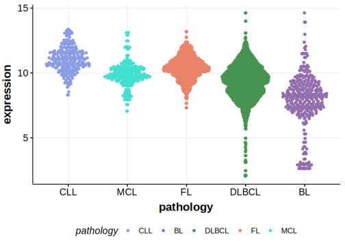

[[_TOC_]]

## Overview
KLF2 (Kruppel-like factor 2) is a transcription factor involved in the regulation of various cellular processes, including apoptosis, proliferation, and differentiation. Mutations in KLF2 have been identified in various B-cell lymphomas including DLBCL.[@pasqualucciAnalysisCodingGenome2011]> KLF2 mutations are among the most common mutations in splenic marginal zone lymphoma (SMZL).[@jalladesExomeSequencingIdentifies2017] 
KLF2 is one of [a number of genes](https://github.com/morinlab/LLMPP/wiki/ashm) affected by aberrant somatic hypermutation in B-cell lymphomas, which complicates the interpretation of mutations at this locus. These mutations are associated with the **BN2** genetic subgroup of DLBCL.[@pasqualucciAnalysisCodingGenome2011] 
KLF2 mutations have been shown to impair the ability of KLF2 to suppress NF-κB activation by TLR, BCR, BAFFR, and TNFR signaling, thereby promoting lymphomagenesis. This implicates KLF2 as a tumor suppressor in B-cell lymphomas.[@jalladesExomeSequencingIdentifies2017] 
Contradictory to this, the mutation pattern in DLBCL implies selective pressure to retain a full-length protein.

## Relevance tier by entity

|Entity|Tier|Description               |
|:------:|:----:|--------------------------|
||1|high-confidence MZL gene[@jalladesExomeSequencingIdentifies2017]|
||2|relevance in PMBL/cHL/GZL not firmly established[@deschGenotypingCirculatingTumor2020]|
| |1 | aSHM target and high-confidence DLBCL gene[@pasqualucciAnalysisCodingGenome2011]|
|    |1 | aSHM target and high-confidence FL gene   |

## Mutation incidence in large patient cohorts (GAMBL reanalysis)

[[include:DLBCL_KLF2.md]]
[[include:FL_KLF2.md]]

## Mutation pattern and selective pressure estimates

[[include:dnds_KLF2.md]]

## aSHM regions

|chr_name|hg19_start|hg19_end|region                                                                                    |regulatory_comment|
|:--------:|:----------:|:--------:|:------------------------------------------------------------------------------------------:|:------------------:|
|chr19   |16434978  |16439011|[TSS](https://genome.ucsc.edu/s/rdmorin/GAMBL%20hg19?position=chr19%3A16434978%2D16439011)|intron            |

## KLF2 Hotspots

| Chromosome |Coordinate (hg19) | ref>alt | HGVSp | 
 | :---:| :---: | :--: | :---: |
| chr19 | 16436719 | G>C | K256N |
| chr19 | 16436723 | A>G | K258E |
| chr19 | 16436726 | C>G | R259G |
| chr19 | 16436726 | C>T | R259C |
| chr19 | 16436755 | CA>TC | T269P |
| chr19 | 16436769 | C>T | T273I |
| chr19 | 16436772 | G>A | C274Y |
| chr19 | 16436775 | G>A | S275N |
| chr19 | 16436775 | G>C | S275T |
| chr19 | 16436784 | G>A | G278D |

[[include:browser_KLF2.md]]

## Expression

[[include:mermaid_KLF2.md]]

## References

<!-- ORIGIN: pasqualucciAnalysisCodingGenome2011 -->
<!-- PMBL: deschGenotypingCirculatingTumor2020 -->
<!-- DLBCL: pasqualucciAnalysisCodingGenome2011 -->
<!-- MZL: jalladesExomeSequencingIdentifies2017 -->
