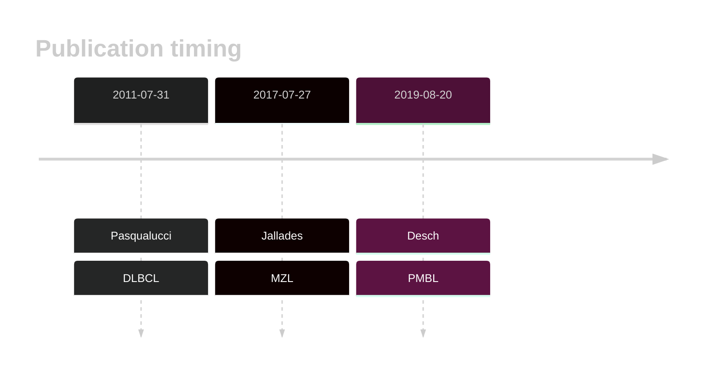
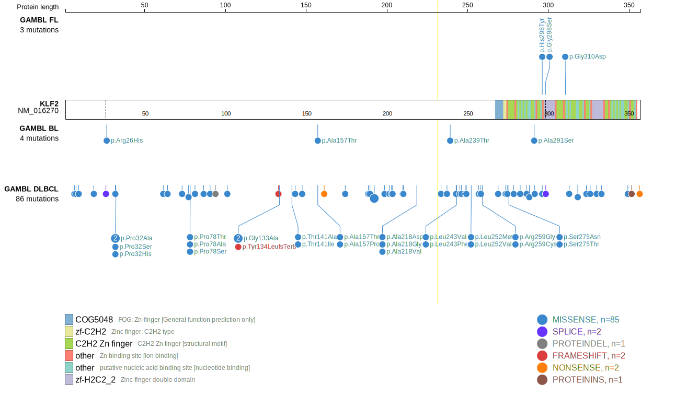
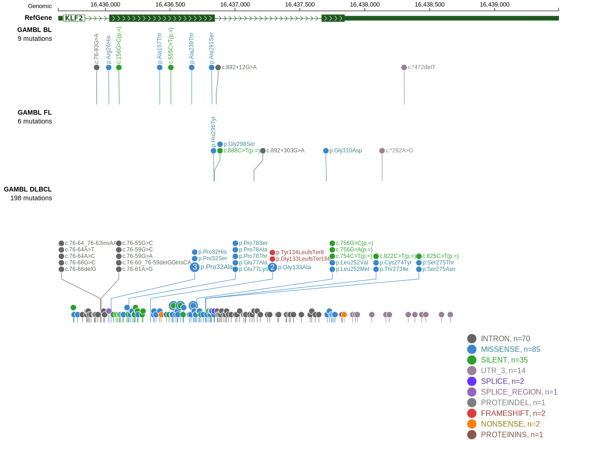

# KLF2

## Overview
KLF2 (Kruppel-like factor 2) is a transcription factor involved in the regulation of various cellular processes, including apoptosis, proliferation, and differentiation. Mutations in KLF2 have been identified in various B-cell lymphomas including DLBCL.1 KLF2 mutations are among the most common mutations in splenic marginal zone lymphoma (SMZL).2 
KLF2 is one of [a number of genes](https://github.com/morinlab/LLMPP/wiki/ashm) affected by aberrant somatic hypermutation in B-cell lymphomas, which complicates the interpretation of mutations at this locus. These mutations are associated with the **BN2** genetic subgroup of DLBCL.3 
KLF2 mutations have been shown to impair the ability of KLF2 to suppress NF-κB activation by TLR, BCR, BAFFR, and TNFR signaling, thereby promoting lymphomagenesis. This implicates KLF2 as a tumor suppressor in B-cell lymphomas.2 
Contradictory to this, the mutation pattern in DLBCL implies selective pressure to retain a full-length protein.

## History

## Relevance tier by entity

|Entity|Tier|Description               |
|:------:|:----:|--------------------------|
||1|high-confidence MZL gene[@jalladesExomeSequencingIdentifies2017]|
||2|relevance in PMBL/cHL/GZL not firmly established[@deschGenotypingCirculatingTumor2020]|
| |1-a | aSHM target and high-confidence DLBCL gene[@pasqualucciAnalysisCodingGenome2011]|
|    |1-a | aSHM target and high-confidence FL gene   |

## Mutation incidence in large patient cohorts (GAMBL reanalysis)

|Entity|source        |frequency (%)|
|:------:|:--------------:|:-------------:|
|DLBCL |GAMBL genomes |8.60         |
|DLBCL |Schmitz cohort|7.02         |
|DLBCL |Reddy cohort  |2.10         |
|DLBCL |Chapuy cohort |2.99         |
|FL    |GAMBL genomes |2.31         |

## Mutation pattern and selective pressure estimates

|Entity|aSHM|Significant selection|dN/dS (missense)|dN/dS (nonsense)|
|:------:|:----:|:---------------------:|:----------------:|:----------------:|
|BL    |Yes |No                   |2.274           |0               |
|DLBCL |Yes |No                   |3.067           |0               |
|FL    |Yes |No                   |9.318           |0               |

## aSHM regions

|chr_name|hg19_start|hg19_end|region                                                                                    |regulatory_comment|
|:--------:|:----------:|:--------:|:------------------------------------------------------------------------------------------:|:------------------:|
|chr19   |16434978  |16439011|[TSS](https://genome.ucsc.edu/s/rdmorin/GAMBL%20hg19?position=chr19%3A16434978%2D16439011)|intron            |

## KLF2 Hotspots

| Chromosome |Coordinate (hg19) | ref>alt | HGVSp | 
 | :---:| :---: | :--: | :---: |
| chr19 | 16436719 | G>C | K256N |
| chr19 | 16436723 | A>G | K258E |
| chr19 | 16436726 | C>G | R259G |
| chr19 | 16436726 | C>T | R259C |
| chr19 | 16436755 | CA>TC | T269P |
| chr19 | 16436769 | C>T | T273I |
| chr19 | 16436772 | G>A | C274Y |
| chr19 | 16436775 | G>A | S275N |
| chr19 | 16436775 | G>C | S275T |
| chr19 | 16436784 | G>A | G278D |

View coding variants in ProteinPaint [hg19](https://morinlab.github.io/LLMPP/GAMBL/KLF2_protein.html)  or [hg38](https://morinlab.github.io/LLMPP/GAMBL/KLF2_protein_hg38.html)

View all variants in GenomePaint [hg19](https://morinlab.github.io/LLMPP/GAMBL/KLF2.html)  or [hg38](https://morinlab.github.io/LLMPP/GAMBL/KLF2_hg38.html)

## KLF2 Expression

## References

<!-- ORIGIN: pasqualucciAnalysisCodingGenome2011 -->
<!-- PMBL: deschGenotypingCirculatingTumor2020 -->
<!-- DLBCL: pasqualucciAnalysisCodingGenome2011 -->
<!-- MZL: jalladesExomeSequencingIdentifies2017 -->
