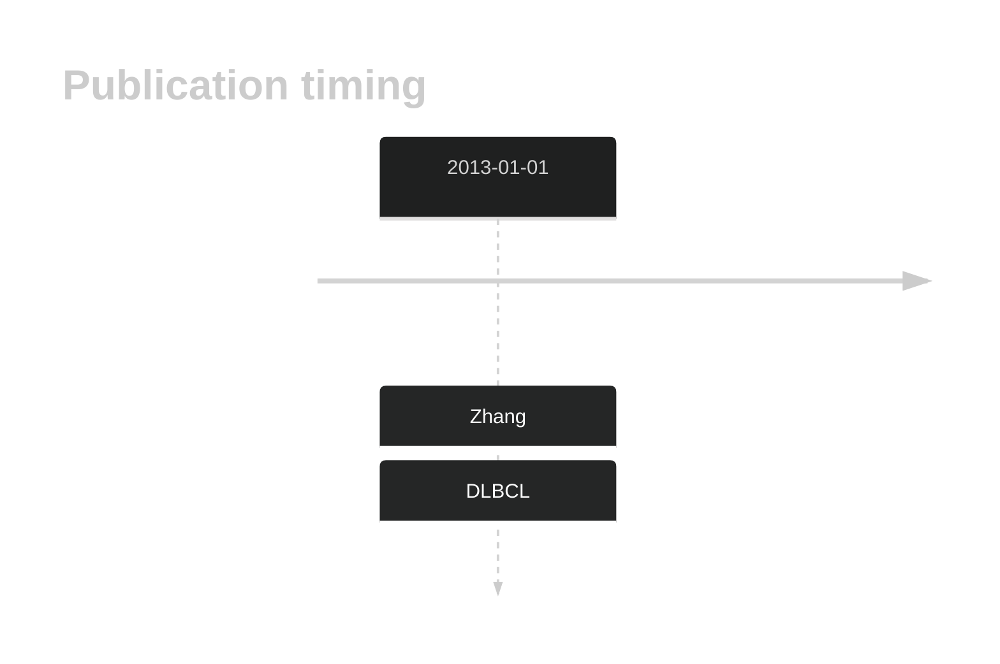

# KLHL14

## Overview
KLHL14 (Kelch-like family member 14) is a gene that has been identified as playing a role in B-cell lymphomas, particularly diffuse large B-cell lymphoma (DLBCL).1 KLHL14 has been identified as a recurrent target of somatic mutations in ABC DLBCLs. These mutations are a feature of the MCD genetic subgroup of DLBCL. The gene encodes a protein involved in the ubiquitin-proteasome system, and its inactivation leads to increased cell proliferation and survival, suggesting its role as a tumor suppressor.2 KLHL14 loss has been shown to BCR-dependent NF-κB activation and cell survival in DLBCL.2 This gene has some mutation hotspots but the patter of mutation overall is consistent with its role as a tumor suppressor gene.

## History

## Relevance tier by entity

|Entity|Tier|Description               |
|:------:|:----:|--------------------------|
| |1   |high-confidence DLBCL gene[@zhangGeneticHeterogeneityDiffuse2013]|

## Mutation incidence in large patient cohorts (GAMBL reanalysis)

|Entity|source        |frequency (%)|
|:------:|:--------------:|:-------------:|
|DLBCL |GAMBL genomes |4.59         |
|DLBCL |Schmitz cohort|6.60         |
|DLBCL |Reddy cohort  |4.60         |
|DLBCL |Chapuy cohort |7.26         |

## Mutation pattern and selective pressure estimates

|Entity|aSHM|Significant selection|dN/dS (missense)|dN/dS (nonsense)|
|:------:|:----:|:---------------------:|:----------------:|:----------------:|
|BL    |No  |No                   | 0.000          | 0.000          |
|DLBCL |No  |No                   | 3.154          | 2.846          |
|FL    |No  |No                   |12.248          |24.944          |

## KLHL14 Hotspots

| Chromosome |Coordinate (hg19) | ref>alt | HGVSp | 
 | :---:| :---: | :--: | :---: |
| chr18 | 30349909 | G>A | L216F |
| chr18 | 30349905 | T>G | N217T |
| chr18 | 30349902 | A>C | F218C |
| chr18 | 30349882 | G>C | L225V |

View coding variants in ProteinPaint [hg19](https://morinlab.github.io/LLMPP/GAMBL/KLHL14_protein.html)  or [hg38](https://morinlab.github.io/LLMPP/GAMBL/KLHL14_protein_hg38.html)

View all variants in GenomePaint [hg19](https://morinlab.github.io/LLMPP/GAMBL/KLHL14.html)  or [hg38](https://morinlab.github.io/LLMPP/GAMBL/KLHL14_hg38.html)

## References

## KLHL14 Expression

<!-- ORIGIN: zhangGeneticHeterogeneityDiffuse2013 -->
<!-- DLBCL: zhangGeneticHeterogeneityDiffuse2013 -->
