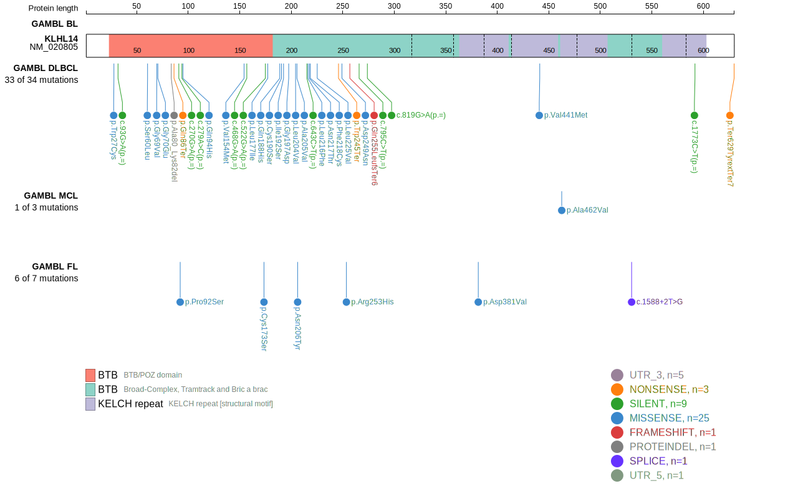
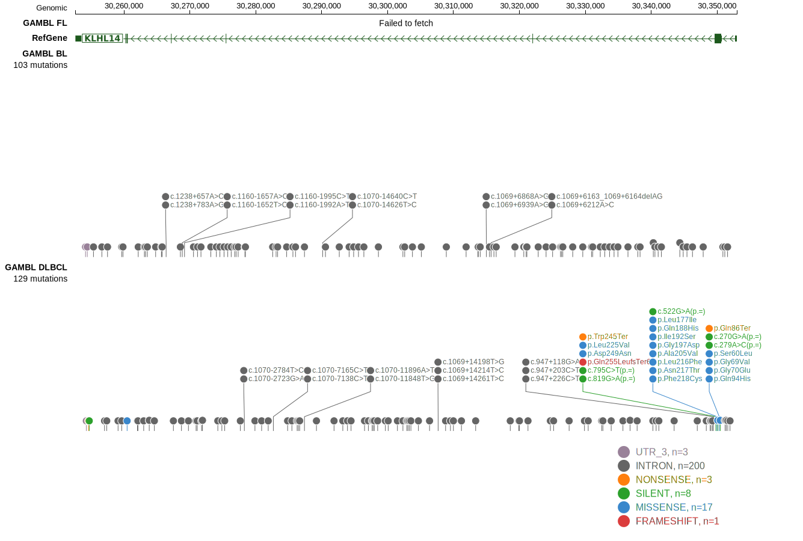

# [KLHL14]

## Mutation tier

|Entity|Tier|Description               |
|:------:|:----:|--------------------------|
|DLBCL |1   |high-confidence DLBCL gene|
## Mutation incidence

|Entity|source        |frequency (%)|
|:------:|:--------------:|:-------------:|
|DLBCL |GAMBL genomes |4.59         |
|DLBCL |Schmitz cohort|6.60         |
|DLBCL |Reddy cohort  |4.60         |
|DLBCL |Chapuy cohort |7.26         |

## Mutation pattern

|Entity|aSHM|Significant selection|dN/dS (missense)|dN/dS (nonsense)|
|:------:|:----:|:---------------------:|:----------------:|:----------------:|
|BL    |No  |No                   | 0.000          | 0.000          |
|DLBCL |No  |No                   | 3.154          | 2.846          |
|FL    |No  |No                   |12.248          |24.944          |

> [!NOTE]
> First described in DLBCL in 2013 by [Zhang J](https://pubmed.ncbi.nlm.nih.gov/23292937)

 ## KLHL14 Hotspots

| Chromosome |Coordinate (hg19) | ref>alt | HGVSp | 
 | :---:| :---: | :--: | :---: |
| chr18 | 30349909 | G>A | L216F |
| chr18 | 30349905 | T>G | N217T |
| chr18 | 30349902 | A>C | F218C |
| chr18 | 30349882 | G>C | L225V |

View coding variants in ProteinPaint [hg19](https://www.bcgsc.ca/downloads/morinlab/GAMBL/test/genes/KLHL14_protein.html)  or [hg38](https://www.bcgsc.ca/downloads/morinlab/GAMBL/test/genes/KLHL14_protein_hg38.html)

View all variants in GenomePaint [hg19](https://www.bcgsc.ca/downloads/morinlab/GAMBL/test/genes/KLHL14.html)  or [hg38](https://www.bcgsc.ca/downloads/morinlab/GAMBL/test/genes/KLHL14_hg38.html)

