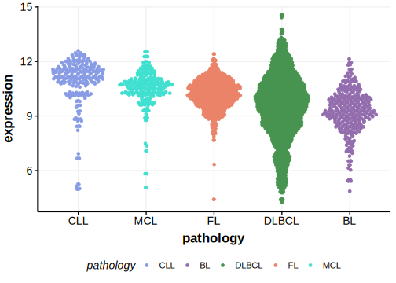

[[_TOC_]]

## Overview
KLHL14 (Kelch-like family member 14) is a gene that has been identified as playing a role in B-cell lymphomas, particularly diffuse large B-cell lymphoma (DLBCL).[@zhangGeneticHeterogeneityDiffuse2013] KLHL14 has been identified as a recurrent target of somatic mutations in ABC DLBCLs. These mutations are a feature of the MCD genetic subgroup of DLBCL. The gene encodes a protein involved in the ubiquitin-proteasome system, and its inactivation leads to increased cell proliferation and survival, suggesting its role as a tumor suppressor.[@schmitzGeneticsPathogenesisDiffuse2018] KLHL14 loss has been shown to BCR-dependent NF-κB activation and cell survival in DLBCL.[@schmitzGeneticsPathogenesisDiffuse2018] This gene has some mutation hotspots but the patter of mutation overall is consistent with its role as a tumor suppressor gene.

## Relevance tier by entity

|Entity|Tier|Description               |
|:------:|:----:|--------------------------|
| |1   |high-confidence DLBCL gene[@zhangGeneticHeterogeneityDiffuse2013; @reddyGeneticFunctionalDrivers2017; @schmitzGeneticsPathogenesisDiffuse2018]|

## Mutation incidence in large patient cohorts (GAMBL reanalysis)

[[include:DLBCL_KLHL14.md]]

## Mutation pattern and selective pressure estimates

[[include:dnds_KLHL14.md]]

## Expression

## KLHL14 Hotspots

| Chromosome |Coordinate (hg19) | ref>alt | HGVSp | 
 | :---:| :---: | :--: | :---: |
| chr18 | 30349909 | G>A | L216F |
| chr18 | 30349905 | T>G | N217T |
| chr18 | 30349902 | A>C | F218C |
| chr18 | 30349882 | G>C | L225V |

[[include:browser_KLHL14.md]]

<!-- ORIGIN: zhangGeneticHeterogeneityDiffuse2013 -->
<!-- DLBCL: zhangGeneticHeterogeneityDiffuse2013 -->
