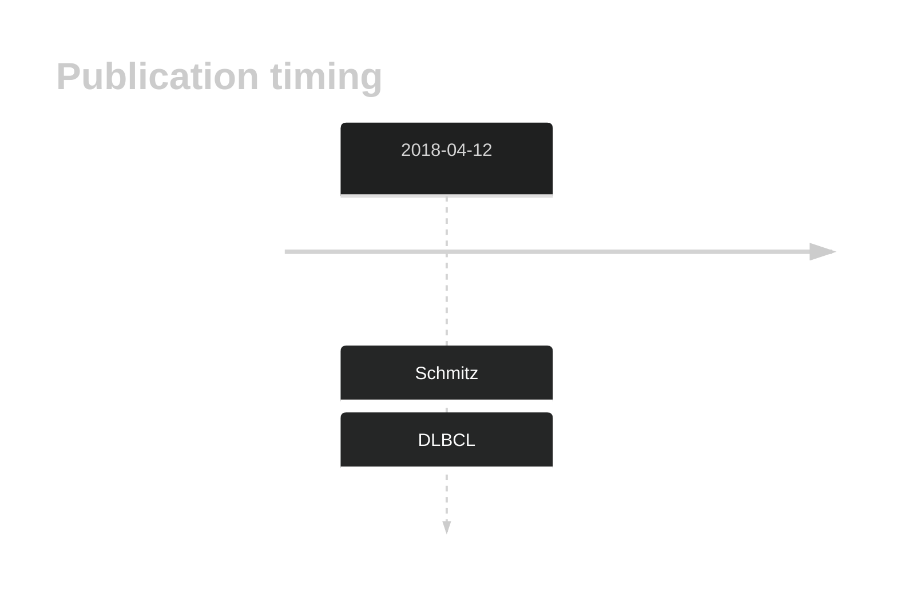

# KLHL21

## History

## Relevance tier by entity

|Entity|Tier|Description                              |
|:------:|:----:|-----------------------------------------|
| |2-a | aSHM target; Although recurrent, the relevance of mutations in DLBCL is tenuous [@schmitzGeneticsPathogenesisDiffuse2018]|

## Mutation incidence in large patient cohorts (GAMBL reanalysis)

|Entity|source        |frequency (%)|
|:------:|:--------------:|:-------------:|
|DLBCL |GAMBL genomes |3.82         |
|DLBCL |Schmitz cohort|4.68         |
|DLBCL |Reddy cohort  |2.50         |
|DLBCL |Chapuy cohort |0.85         |

## Mutation pattern and selective pressure estimates

|Entity|aSHM|Significant selection|dN/dS (missense)|dN/dS (nonsense)|
|:------:|:----:|:---------------------:|:----------------:|:----------------:|
|BL    |Yes |No                   |0.000           |0               |
|DLBCL |Yes |No                   |1.741           |0               |
|FL    |Yes |No                   |0.000           |0               |

## aSHM regions

|chr_name|hg19_start|hg19_end|region                                                                                 |regulatory_comment|
|:--------:|:----------:|:--------:|:---------------------------------------------------------------------------------------:|:------------------:|
|chr1    |6661482   |6662702 |[TSS](https://genome.ucsc.edu/s/rdmorin/GAMBL%20hg19?position=chr1%3A6661482%2D6662702)|NA                |

View coding variants in ProteinPaint [hg19](https://morinlab.github.io/LLMPP/GAMBL/KLHL21_protein.html)  or [hg38](https://morinlab.github.io/LLMPP/GAMBL/KLHL21_protein_hg38.html)

View all variants in GenomePaint [hg19](https://morinlab.github.io/LLMPP/GAMBL/KLHL21.html)  or [hg38](https://morinlab.github.io/LLMPP/GAMBL/KLHL21_hg38.html)

## KLHL21 Expression

<!-- ORIGIN: schmitzGeneticsPathogenesisDiffuse2018 -->
<!-- DLBCL: schmitzGeneticsPathogenesisDiffuse2018 -->

## References

