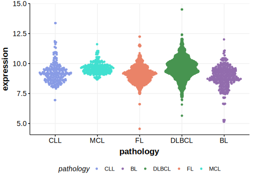

[[_TOC_]]

## Relevance tier by entity

[[include:table1_KLHL21.md]]

## Mutation incidence in large patient cohorts (GAMBL reanalysis)

|Entity|source        |frequency (%)|
|:------:|:--------------:|:-------------:|
|DLBCL |GAMBL genomes |3.82         |
|DLBCL |Schmitz cohort|4.68         |
|DLBCL |Reddy cohort  |2.50         |
|DLBCL |Chapuy cohort |0.85         |

## Mutation pattern and selective pressure estimates

[[include:dnds_KLHL21.md]]

## aSHM regions

|chr_name|hg19_start|hg19_end|region                                                                                 |regulatory_comment|
|:--------:|:----------:|:--------:|:---------------------------------------------------------------------------------------:|:------------------:|
|chr1    |6661482   |6662702 |[TSS](https://genome.ucsc.edu/s/rdmorin/GAMBL%20hg19?position=chr1%3A6661482%2D6662702)|NA                |

[[include:browser_KLHL21.md]]

## Expression

<!-- ORIGIN: schmitzGeneticsPathogenesisDiffuse2018 -->
<!-- DLBCL: schmitzGeneticsPathogenesisDiffuse2018 -->

[[include:mermaid_KLHL21.md]]

## References

