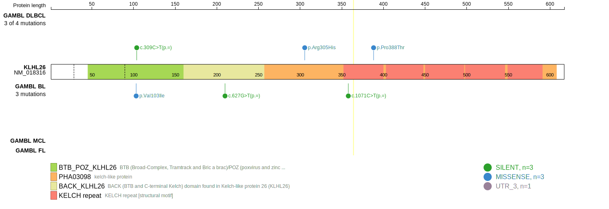
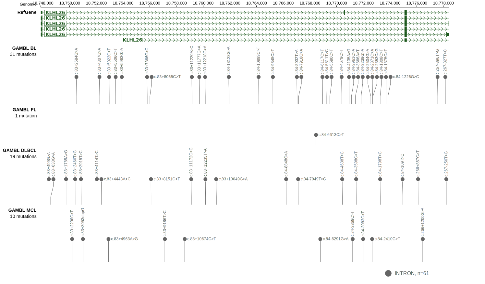
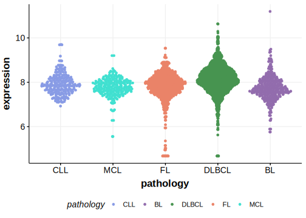

[[_TOC_]]

## Relevance tier by entity

|Entity|Tier|Description                           |
|:------:|:----:|--------------------------------------|
|    |2   |relevance in BL not firmly established[@burkhardtClinicalRelevanceMolecular2022]|

## Mutation incidence in large patient cohorts (GAMBL reanalysis)

|Entity|source               |frequency (%)|
|:------:|:---------------------:|:-------------:|
|BL    |GAMBL genomes+capture|0.46         |
|BL    |Thomas cohort        |  NA         |
|BL    |Panea cohort         |  NA         |

## Mutation pattern and selective pressure estimates

[[include:dnds_KLHL26.md]]

View coding variants in ProteinPaint [hg19](https://morinlab.github.io/LLMPP/GAMBL/KLHL26_protein.html)  or [hg38](https://morinlab.github.io/LLMPP/GAMBL/KLHL26_protein_hg38.html)

View all variants in GenomePaint [hg19](https://morinlab.github.io/LLMPP/GAMBL/KLHL26.html)  or [hg38](https://morinlab.github.io/LLMPP/GAMBL/KLHL26_hg38.html)

## KLHL26 Expression

<!-- ORIGIN: burkhardtClinicalRelevanceMolecular2022 -->
<!-- BL: burkhardtClinicalRelevanceMolecular2022 -->

[[include:mermaid_KLHL26.md]]

## References
