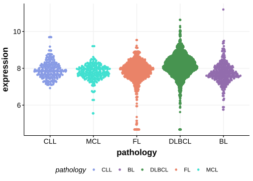

[[_TOC_]]

## Relevance tier by entity

[[include:tables/table1_KLHL26.md]]

## Mutation incidence in large patient cohorts (GAMBL reanalysis)

### FL
[[include:tables/FL_KLHL26.md]]

### BL
[[include:tables/BL_KLHL26.md]]

### DLBCL
[[include:tables/DLBCL_KLHL26.md]]

## Mutation pattern and selective pressure estimates

[[include:tables/dnds_KLHL26.md]]

[[include:tables/browser_KLHL26.md]]

## Expression

<!-- ORIGIN: burkhardtClinicalRelevanceMolecular2022 -->
<!-- BL: burkhardtClinicalRelevanceMolecular2022 -->

[[include:tables/mermaid_KLHL26.md]]

## References
