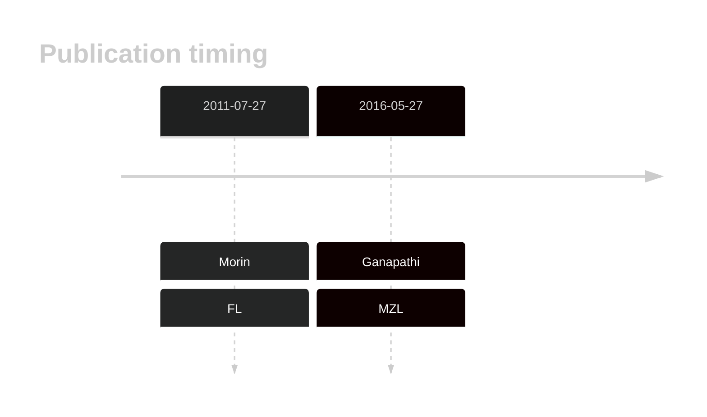
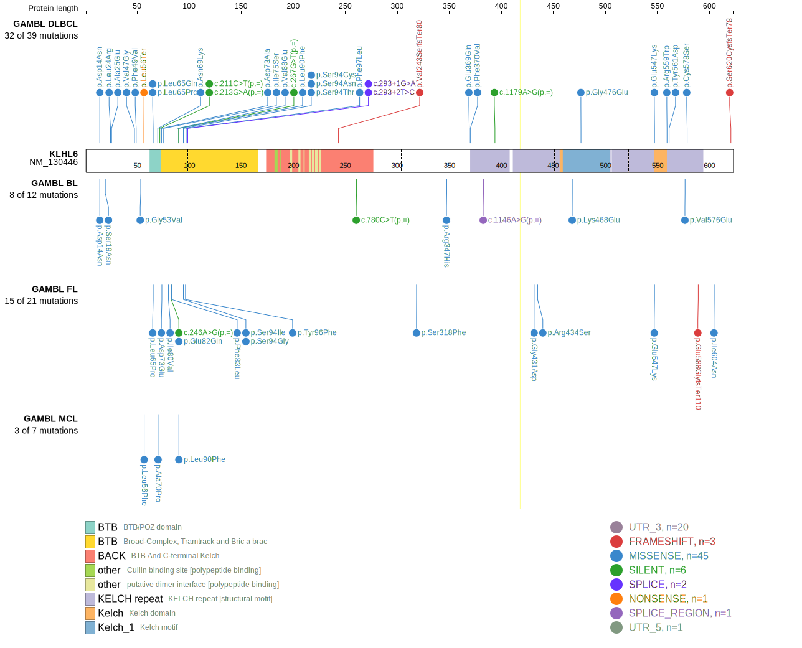
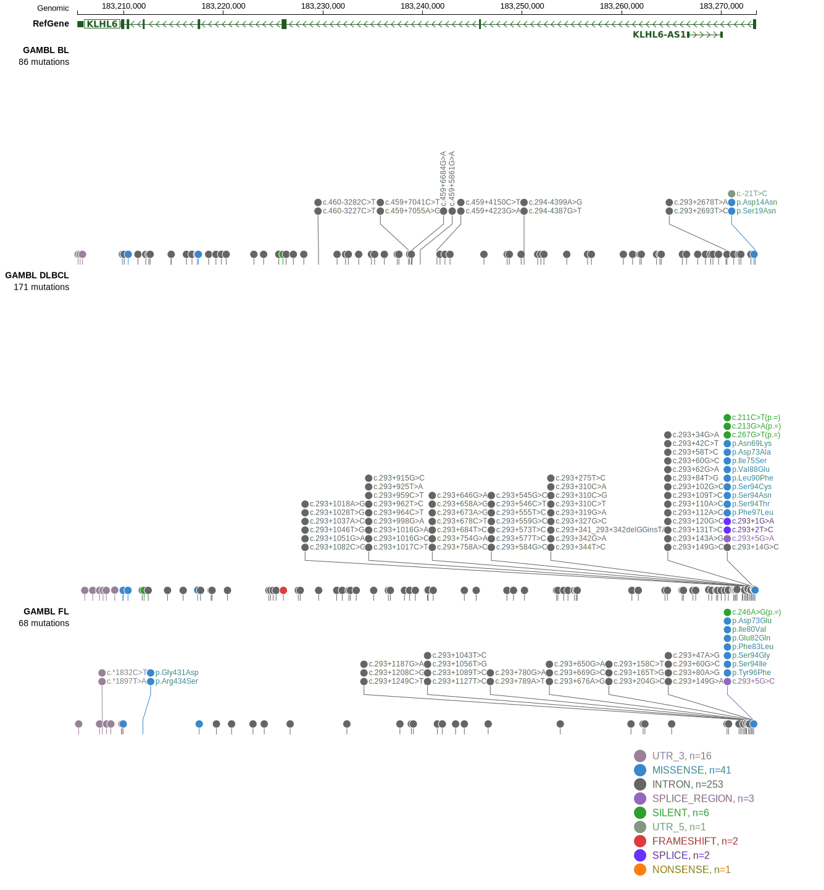
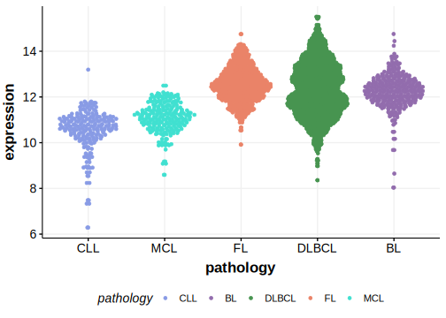

# KLHL6

## Overview
KLHL6 mutations appear to be relatively common in DLBCL, FL and possibly BL.1 KLHL6 is one of [a number of genes](https://github.com/morinlab/LLMPP/wiki/ashm) affected by aberrant somatic hypermutation in B-cell lymphomas, which complicates the interpretation of mutations at this locus. KLHL6 mutations lead to the loss of its function as part of a cullin-RING ubiquitin ligase complex. 
KLHL6 is considered a tumor suppressor gene in DLBCL with mutations tending to disrupt its interaction with cullin3, leading to the loss of its ligase activity.2 

## History

## Relevance tier by entity

|Entity|Tier|Description                           |
|:------:|:----:|--------------------------------------|
||1|high-confidence MZL gene|
| |1-a | aSHM target and high-confidence DLBCL gene            |
|    |1-a | aSHM target and high-confidence FL gene               |
|    |2-a | aSHM target; Although recurrent, the relevance of mutations in BL is tenuous |

## Mutation incidence in large patient cohorts (GAMBL reanalysis)

|Entity|source               |frequency (%)|
|:------:|:---------------------:|:-------------:|
|DLBCL |GAMBL genomes        |5.35         |
|DLBCL |Schmitz cohort       |9.15         |
|DLBCL |Reddy cohort         |6.41         |
|DLBCL |Chapuy cohort        |8.97         |
|FL    |GAMBL genomes        |7.16         |
|BL    |GAMBL genomes+capture|3.93         |
|BL    |Thomas cohort        |3.00         |
|BL    |Panea cohort         |6.90         |

## Mutation pattern and selective pressure estimates

|Entity|aSHM|Significant selection|dN/dS (missense)|dN/dS (nonsense)|
|:------:|:----:|:---------------------:|:----------------:|:----------------:|
|BL    |Yes |No                   | 4.630          | 0.000          |
|DLBCL |Yes |No                   | 7.379          | 6.684          |
|FL    |Yes |Yes                  |20.169          |55.914          |

## aSHM regions

|chr_name|hg19_start|hg19_end |region                                                                                     |regulatory_comment             |
|:--------:|:----------:|:---------:|:-------------------------------------------------------------------------------------------:|:-------------------------------:|
|chr3    |183269360 |183274139|[TSS](https://genome.ucsc.edu/s/rdmorin/GAMBL%20hg19?position=chr3%3A183269360%2D183274139)|active_promoter-strong_enhancer|

 ## KLHL6 Hotspots

| Chromosome |Coordinate (hg19) | ref>alt | HGVSp | 
 | :---:| :---: | :--: | :---: |
| chr3 | 183273284 | C>A | G53V |
| chr3 | 183273275 | A>T | L56* |
| chr3 | 183273274 | T>G | L56F |
| chr3 | 183273248 | A>T | L65Q |
| chr3 | 183273248 | A>G | L65P |
| chr3 | 183273235 | G>C | N69K |
| chr3 | 183273234 | C>G | A70P |
| chr3 | 183273224 | T>G | D73A |
| chr3 | 183273223 | A>C | D73E |
| chr3 | 183273218 | A>C | I75S |
| chr3 | 183273204 | T>C | I80V |
| chr3 | 183273198 | C>G | E82Q |
| chr3 | 183273195 | A>G | F83L |
| chr3 | 183273179 | A>T | V88E |
| chr3 | 183273174 | G>A | L90F |
| chr3 | 183273162 | T>C | S94G |
| chr3 | 183273162 | T>A | S94C |
| chr3 | 183273161 | C>T | S94N |
| chr3 | 183273161 | C>G | S94T |
| chr3 | 183273161 | C>A | S94I |
| chr3 | 183273155 | T>A | Y96F |
| chr3 | 183273153 | A>G | F97L |

View coding variants in ProteinPaint [hg19](https://morinlab.github.io/LLMPP/GAMBL/KLHL6_protein.html)  or [hg38](https://morinlab.github.io/LLMPP/GAMBL/KLHL6_protein_hg38.html)

View all variants in GenomePaint [hg19](https://morinlab.github.io/LLMPP/GAMBL/KLHL6.html)  or [hg38](https://morinlab.github.io/LLMPP/GAMBL/KLHL6_hg38.html)

## KLHL6 Expression

<!-- ORIGIN: morinFrequentMutationHistonemodifying2011 -->

## References
1. *Morin RD, Mendez-Lago M, Mungall AJ, Goya R, Mungall KL, Corbett RD, Johnson NA, Severson TM, Chiu R, Field M, Jackman S, Krzywinski M, Scott DW, Trinh DL, Tamura-Wells J, Li S, Firme MR, Rogic S, Griffith M, Chan S, Yakovenko O, Meyer IM, Zhao EY, Smailus D, Moksa M, Chittaranjan S, Rimsza L, Brooks-Wilson A, Spinelli JJ, Ben-Neriah S, Meissner B, Woolcock B, Boyle M, McDonald H, Tam A, Zhao Y, Delaney A, Zeng T, Tse K, Butterfield Y, Birol I, Holt R, Schein J, Horsman DE, Moore R, Jones SJ, Connors JM, Hirst M, Gascoyne RD, Marra MA. Frequent mutation of histone-modifying genes in non-Hodgkin lymphoma. Nature. 2011 Jul 27;476(7360):298-303. doi: 10.1038/nature10351. PMID: 21796119; PMCID: PMC3210554.*
2. *Choi, J., Zhou, N., & Busino, L. (2019). KLHL6 is a tumor suppressor gene in diffuse large B-cell lymphoma. Cell Cycle, 18, 249 - 256. https://doi.org/10.1080/15384101.2019.1568765.*
<!-- MZL: ganapathiGeneticLandscapeDural2016 -->
<!-- DLBCL: morinFrequentMutationHistonemodifying2011 -->
<!-- BL: 2 -->
<!-- FL: morinFrequentMutationHistonemodifying2011 -->
