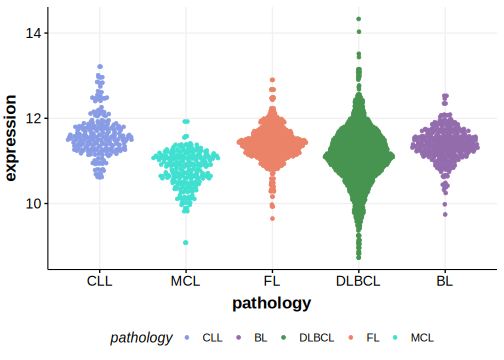

# Gene: {{page_name}}

[[_TOC_]]

<<Note("The pattern of mutations in KMT2C does not support its role in DLBCL")>>

## Overview
This gene has been reported to be recurrently mutated in DLBCL. The rate of mutations in KMT2C (MLL3) varies across published cohorts. In the initial study describing these mutations, it was suggested to be mutated in >15% of DLBCLs.[@sarkozyMutationalLandscapeGray2021] The actual rate of mutations may be much lower,[@zhouSporadicEndemicBurkitt2019] potentially due to the existence of germline variants in some studies.[@zhangGeneticHeterogeneityDiffuse2013] A more recent study suggested KMT2C mutations were more common in DLBCLs in patients of African ancestry.[@reddyGeneticFunctionalDrivers2017] Although KMT2C mutations have been described as a feature of MCL in a single study, this pattern was not reproduced in other cohorts.[@zhangGenomicLandscapeMantle2014]
[Selective pressure analysis](#mutation-pattern-and-selective-pressure-estimates) did not identify this gene as significantly enriched for either missense or truncating mutations,
indicating that many, if not all, of the mutations in DLBCL may represent passengers.

## Relevance tier by entity

[[include:tables/table1_KMT2C.md]]

## Mutation incidence in large patient cohorts (GAMBL reanalysis)

### DLBCL
[[include:tables/DLBCL_KMT2C.md]]

### FL
[[include:tables/FL_KMT2C.md]]

### BL
[[include:tables/BL_KMT2C.md]]

### MCL
[[include:tables/MCL_KMT2C.md]]

## Mutation pattern and selective pressure estimates

[[include:tables/dnds_KMT2C.md]]

[[include:tables/browser_KMT2C.md]]

## Expression

<!-- ORIGIN: zhangGeneticHeterogeneityDiffuse2013 -->
<!-- BL: zhouSporadicEndemicBurkitt2019 -->
<!-- BL: zhouSporadicEndemicBurkitt2019 -->
<!-- MCL: zhangGenomicLandscapeMantle2014 -->
<!-- DLBCL: zhangGeneticHeterogeneityDiffuse2013 -->
<!-- PMBL: sarkozyMutationalLandscapeGray2021a -->

[[include:tables/mermaid_KMT2C.md]]

## References

