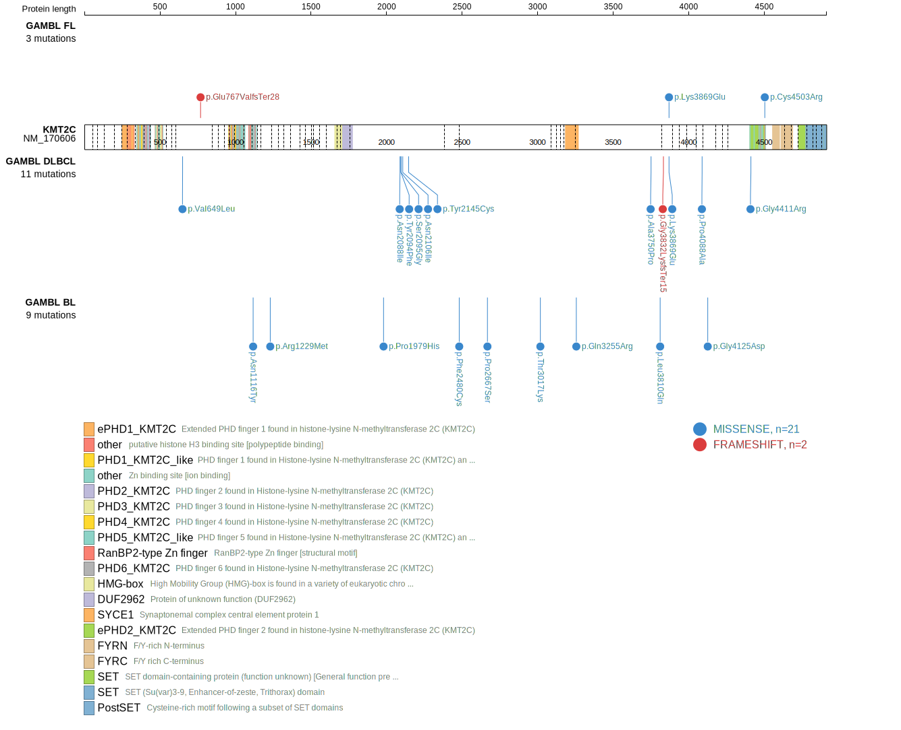

# KMT2C

## Overview
This gene has been reported to be recurrently mutated in DLBCL. The rate of mutations in KMT2C (MLL3) varies across published cohorts. In the initial study describing these mutations, it was suggested to be mutated in >15% of DLBCLs.1 The actual rate of mutations may be much lower,2 potentially due to the existence of germline variants in some studies.3 A more recent study suggested KMT2C mutations were more common in DLBCLs in patients of African ancestry.4 Although KMT2C mutations have been described as a feature of MCL in a single study, this pattern was not reproduced in other cohorts.5

## History

## Relevance tier by entity

|Entity|Tier|Description                            |
|:------:|:----:|---------------------------------------|
||1|high-confidence PMBL/cHL/GZL gene[@sarkozyMutationalLandscapeGray2021a]|
|    |2   |relevance in BL not firmly established [@zhouSporadicEndemicBurkitt2019]|
| |1   |high-confidence DLBCL gene             [@zhangGeneticHeterogeneityDiffuse2013; @reddyGeneticFunctionalDrivers2017]|
|   |2   |relevance in MCL not firmly established[@zhangGenomicLandscapeMantle2014]|

## Mutation incidence in large patient cohorts (GAMBL reanalysis)

|Entity|source               |frequency (%)|
|:------:|:---------------------:|:-------------:|
|DLBCL |GAMBL genomes        |3.25         |
|DLBCL |Schmitz cohort       |8.30         |
|DLBCL |Reddy cohort         |7.31         |
|DLBCL |Chapuy cohort        |6.41         |
|BL    |GAMBL genomes+capture|6.47         |
|BL    |Thomas cohort        |  NA         |
|BL    |Panea cohort         |  NA         |
|MCL   |GAMBL genomes        |0.47         |

## Mutation pattern and selective pressure estimates

|Entity|aSHM|Significant selection|dN/dS (missense)|dN/dS (nonsense)|
|:------:|:----:|:---------------------:|:----------------:|:----------------:|
|BL    |No  |No                   |0.628           |0.000           |
|DLBCL |No  |No                   |1.569           |1.911           |
|FL    |No  |No                   |0.550           |0.000           |

View coding variants in ProteinPaint [hg19](https://morinlab.github.io/LLMPP/GAMBL/KMT2C_protein.html)  or [hg38](https://morinlab.github.io/LLMPP/GAMBL/KMT2C_protein_hg38.html)

View all variants in GenomePaint [hg19](https://morinlab.github.io/LLMPP/GAMBL/KMT2C.html)  or [hg38](https://morinlab.github.io/LLMPP/GAMBL/KMT2C_hg38.html)

## KMT2C Expression

<!-- ORIGIN: zhangGeneticHeterogeneityDiffuse2013 -->
<!-- BL: zhouSporadicEndemicBurkitt2019 -->
<!-- BL: zhouSporadicEndemicBurkitt2019 -->
<!-- MCL: zhangGenomicLandscapeMantle2014 -->
<!-- DLBCL: zhangGeneticHeterogeneityDiffuse2013 -->
<!-- PMBL: sarkozyMutationalLandscapeGray2021a -->

## References

