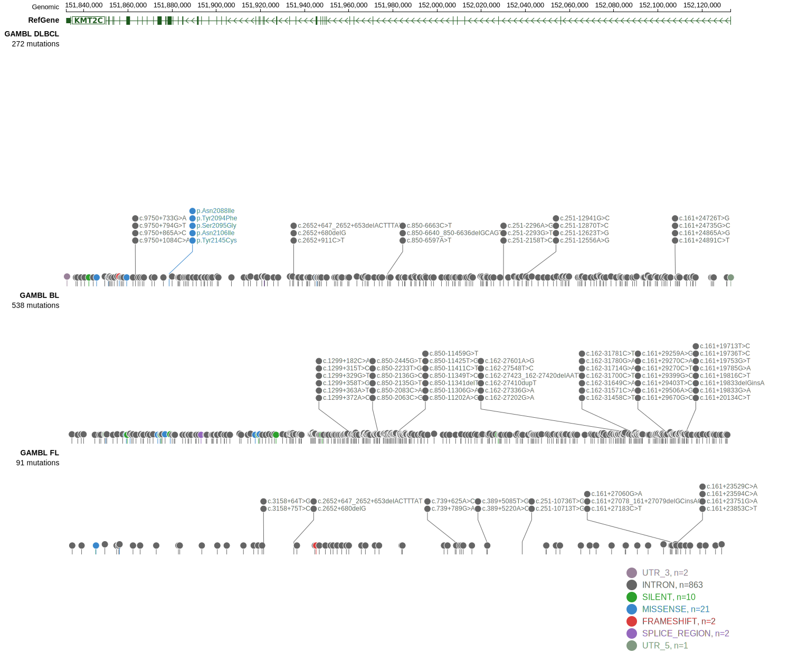

# KMT2C
## Overview
This gene has been reported to be recurrently mutated in DLBCL. The rate of mutations in KMT2C (MLL3) varies across published cohorts. In the initial study describing these mutations, it was suggested to be mutated in >15% of DLBCLs.1 The actual rate of mutations may be much lower,2 potentially due to the existence of germline variants in some studies.3 

## Relevance tier by entity

|Entity|Tier|Description                            |
|:------:|:----:|---------------------------------------|
|BL    |2   |relevance in BL not firmly established |
|DLBCL |1   |high-confidence DLBCL gene             |
|MCL   |2   |relevance in MCL not firmly established|

## Mutation incidence in large patient cohorts (GAMBL reanalysis)

|Entity|source               |frequency (%)|
|:------:|:---------------------:|:-------------:|
|DLBCL |GAMBL genomes        |3.25         |
|DLBCL |Schmitz cohort       |8.30         |
|DLBCL |Reddy cohort         |7.31         |
|DLBCL |Chapuy cohort        |6.41         |
|BL    |GAMBL genomes+capture|6.47         |
|BL    |Thomas cohort        |  NA         |
|BL    |Panea cohort         |  NA         |
|MCL   |GAMBL genomes        |0.47         |

## Mutation pattern and selective pressure estimates

|Entity|aSHM|Significant selection|dN/dS (missense)|dN/dS (nonsense)|
|:------:|:----:|:---------------------:|:----------------:|:----------------:|
|BL    |No  |No                   |0.628           |0.000           |
|DLBCL |No  |No                   |1.569           |1.911           |
|FL    |No  |No                   |0.550           |0.000           |

> [!NOTE]
> First described in BL in 2019 by [Zhou P](https://pubmed.ncbi.nlm.nih.gov/31300419). First described in DLBCL in 2013 by [Zhang J](https://pubmed.ncbi.nlm.nih.gov/23292937). First described in MCL in 2014 by [Zhang J](https://pubmed.ncbi.nlm.nih.gov/24682267)

View coding variants in ProteinPaint [hg19](https://morinlab.github.io/LLMPP/GAMBL/KMT2C_protein.html)  or [hg38](https://morinlab.github.io/LLMPP/GAMBL/KMT2C_protein_hg38.html)

View all variants in GenomePaint [hg19](https://morinlab.github.io/LLMPP/GAMBL/KMT2C.html)  or [hg38](https://morinlab.github.io/LLMPP/GAMBL/KMT2C_hg38.html)

## References
1. *Zhang J, Grubor V, Love CL, Banerjee A, Richards KL, Mieczkowski PA, Dunphy C, Choi W, Au WY, Srivastava G, Lugar PL, Rizzieri DA, Lagoo AS, Bernal-Mizrachi L, Mann KP, Flowers C, Naresh K, Evens A, Gordon LI, Czader M, Gill JI, Hsi ED, Liu Q, Fan A, Walsh K, Jima D, Smith LL, Johnson AJ, Byrd JC, Luftig MA, Ni T, Zhu J, Chadburn A, Levy S, Dunson D, Dave SS. Genetic heterogeneity of diffuse large B-cell lymphoma. Proc Natl Acad Sci U S A. 2013 Jan 22;110(4):1398-403. doi: 10.1073/pnas.1205299110. Epub 2013 Jan 4. PMID: 23292937; PMCID: PMC3557051.*
2. *Reddy A, Zhang J, Davis NS, Moffitt AB, Love CL, Waldrop A, Leppa S, Pasanen A, Meriranta L, Karjalainen-Lindsberg ML, Nørgaard P, Pedersen M, Gang AO, Høgdall E, Heavican TB, Lone W, Iqbal J, Qin Q, Li G, Kim SY, Healy J, Richards KL, Fedoriw Y, Bernal-Mizrachi L, Koff JL, Staton AD, Flowers CR, Paltiel O, Goldschmidt N, Calaminici M, Clear A, Gribben J, Nguyen E, Czader MB, Ondrejka SL, Collie A, Hsi ED, Tse E, Au-Yeung RKH, Kwong YL, Srivastava G, Choi WWL, Evens AM, Pilichowska M, Sengar M, Reddy N, Li S, Chadburn A, Gordon LI, Jaffe ES, Levy S, Rempel R, Tzeng T, Happ LE, Dave T, Rajagopalan D, Datta J, Dunson DB, Dave SS. Genetic and Functional Drivers of Diffuse Large B Cell Lymphoma. Cell. 2017 Oct 5;171(2):481-494.e15. doi: 10.1016/j.cell.2017.09.027. PMID: 28985567; PMCID: PMC5659841.*
3. *https://pubpeer.com/publications/C1086AC68FD7082E3811E097EA4EA0*
