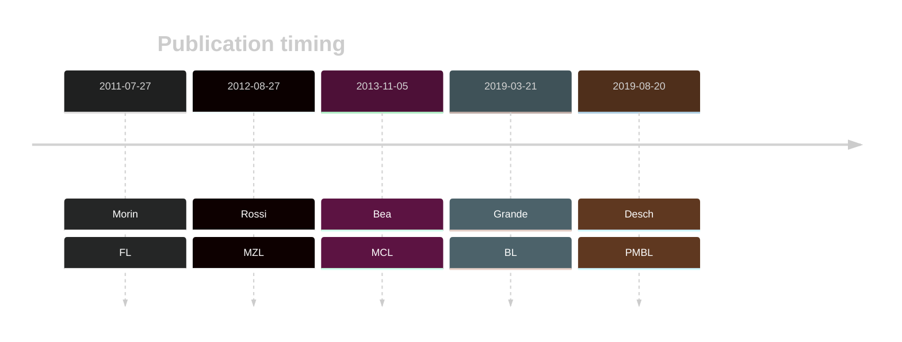

# KMT2D

## Overview
KMT2D (also known as MLL2) encodes a histone H3K4 methyltransferase, playing a crucial role in germinal center B cell development and function. Mutations in KMT2D are among the most common mutations in FL and are also common in DLBCL.1 KMT2D mutations are recurrent but less common in BL and MCL and many other B-cell neoplasms. Mutations typically cause loss of KMT2D function, leading to diminished H3K4 methylation, impacting gene expression that favours lymphomagenesis. KMT2D mutations are associated with poor prognosis in DLBCL.2,3

## History
First identified as mutated in DLBCL and FL in 2011 by Morin et al.1
Mutations were later described in MCL in 2013 by Bea et al.4 KMT2D mutations were later reported in BL by Grande et al.5

## Relevance tier by entity

|Entity|Tier|Description               |
|:------:|:----:|--------------------------|
||1|high-confidence MZL gene|
||2|relevance in PMBL/cHL/GZL not firmly established|
|    |1   |high-confidence FL gene   |
| |1   |high-confidence DLBCL gene|
|    |1   |high-confidence BL gene   |
|   |1   |high-confidence MCL gene  |

## Mutation incidence in large patient cohorts (GAMBL reanalysis)

|Entity|source               |frequency (%)|
|:------:|:---------------------:|:-------------:|
|FL    |GAMBL genomes        |67.67        |
|DLBCL |GAMBL genomes        |33.46        |
|DLBCL |Schmitz cohort       |34.47        |
|DLBCL |Reddy cohort         |22.32        |
|DLBCL |Chapuy cohort        |26.07        |
|BL    |GAMBL genomes+capture|11.32        |
|BL    |Thomas cohort        |14.00        |
|BL    |Panea cohort         |15.80        |
|MCL   |GAMBL genomes        |16.59        |

## Mutation pattern and selective pressure estimates

|Entity|aSHM|Significant selection|dN/dS (missense)|dN/dS (nonsense)|
|:------:|:----:|:---------------------:|:----------------:|:----------------:|
|BL    |No  |Yes                  | 0.689          |  13.459        |
|DLBCL |No  |Yes                  | 3.731          | 104.190        |
|FL    |No  |Yes                  |20.755          |1353.812        |

View coding variants in ProteinPaint [hg19](https://morinlab.github.io/LLMPP/GAMBL/KMT2D_protein.html)  or [hg38](https://morinlab.github.io/LLMPP/GAMBL/KMT2D_protein_hg38.html)

View all variants in GenomePaint [hg19](https://morinlab.github.io/LLMPP/GAMBL/KMT2D.html)  or [hg38](https://morinlab.github.io/LLMPP/GAMBL/KMT2D_hg38.html)

## KMT2D Expression

## References
1.  Morin RD, Mendez-Lago M, Mungall AJ, Goya R, Mungall KL, Corbett RD, Johnson NA, Severson TM, Chiu R, Field M, Jackman S, Krzywinski M, Scott DW, Trinh DL, Tamura-Wells J, Li S, Firme MR, Rogic S, Griffith M, Chan S, Yakovenko O, Meyer IM, Zhao EY, Smailus D, Moksa M, Chittaranjan S, Rimsza L, Brooks-Wilson A, Spinelli JJ, Ben-Neriah S, Meissner B, Woolcock B, Boyle M, McDonald H, Tam A, Zhao Y, Delaney A, Zeng T, Tse K, Butterfield Y, Birol I, Holt R, Schein J, Horsman DE, Moore R, Jones SJM, Connors JM, Hirst M, Gascoyne RD, Marra MA. Frequent mutation of histone-modifying genes in non-Hodgkin lymphoma. Nature. 2011 Jul 27;476(7360):298–303. PMCID: PMC3210554
2. *You, H., Xu-Monette, Z., Wei, L., Nunns, H., Nagy, M., Bhagat, G., Fang, X., Zhu, F., Visco, C., Tzankov, A., Dybkaer, K., Chiu, A., Tam, W., Zu, Y., Hsi, E., Hagemeister, F., Huh, J., Ponzoni, M., Ferreri, A., Møller, M., Parsons, B., Krieken, J., Piris, M., Winter, J., Li, Y., Au, Q., Xu, B., Albitar, M., & Young, K. (2021). Genomic complexity is associated with epigenetic regulator mutations and poor prognosis in diffuse large B-cell lymphoma. Oncoimmunology, 10. https://doi.org/10.1080/2162402X.2021.1928365.*
3. *Rushton CK, Arthur SE, Alcaide M, Cheung M, Jiang A, Coyle KM, Cleary KLS, Thomas N, Hilton LK, Michaud N, Daigle S, Davidson J, Bushell K, Yu S, Rys RN, Jain M, Shepherd L, Marra MA, Kuruvilla J, Crump M, Mann K, Assouline S, Connors JM, Steidl C, Cragg MS, Scott DW, Johnson NA, Morin RD. Genetic and evolutionary patterns of treatment resistance in relapsed B-cell lymphoma. Blood Adv. 2020 Jul 14;4(13):2886-2898. doi: 10.1182/bloodadvances.2020001696. PMID: 32589730; PMCID: PMC7362366.*
4.  Rossi D, Trifonov V, Fangazio M, Bruscaggin A, Rasi S, Spina V, Monti S, Vaisitti T, Arruga F, Famà R, Ciardullo C, Greco M, Cresta S, Piranda D, Holmes A, Fabbri G, Messina M, Rinaldi A, Wang J, Agostinelli C, Piccaluga PP, Lucioni M, Tabbò F, Serra R, Franceschetti S, Deambrogi C, Daniele G, Gattei V, Marasca R, Facchetti F, Arcaini L, Inghirami G, Bertoni F, Pileri SA, Deaglio S, Foà R, Dalla-Favera R, Pasqualucci L, Rabadan R, Gaidano G. The coding genome of splenic marginal zone lymphoma: activation of NOTCH2 and other pathways regulating marginal zone development. J Exp Med. 2012 Aug 27;209(9):1537–1551. PMCID: PMC3428941
5.  Beà S, Valdés-Mas R, Navarro A, Salaverria I, Martín-Garcia D, Jares P, Giné E, Pinyol M, Royo C, Nadeu F, Conde L, Juan M, Clot G, Vizán P, Croce LD, Puente DA, López-Guerra M, Moros A, Roue G, Aymerich M, Villamor N, Colomo L, Martínez A, Valera A, Martín-Subero JI, Amador V, Hernández L, Rozman M, Enjuanes A, Forcada P, Muntañola A, Hartmann EM, Calasanz MJ, Rosenwald A, Ott G, Hernández-Rivas JM, Klapper W, Siebert R, Wiestner A, Wilson WH, Colomer D, López-Guillermo A, López-Otín C, Puente XS, Campo E. Landscape of somatic mutations and clonal evolution in mantle cell lymphoma. PNAS. 2013 Nov 5;110(45):18250–18255. PMID: 24145436
6.  Grande BM, Gerhard DS, Jiang A, Griner NB, Abramson JS, Alexander TB, Allen H, Ayers LW, Bethony JM, Bhatia K, Bowen J, Casper C, Choi JK, Culibrk L, Davidsen TM, Dyer MA, Gastier-Foster JM, Gesuwan P, Greiner TC, Gross TG, Hanf B, Harris NL, He Y, Irvin JD, Jaffe ES, Jones SJM, Kerchan P, Knoetze N, Leal FE, Lichtenberg TM, Ma Y, Martin JP, Martin MR, Mbulaiteye SM, Mullighan CG, Mungall AJ, Namirembe C, Novik K, Noy A, Ogwang MD, Omoding A, Orem J, Reynolds SJ, Rushton CK, Sandlund JT, Schmitz R, Taylor C, Wilson WH, Wright GW, Zhao EY, Marra MA, Morin RD, Staudt LM. Genome-wide discovery of somatic coding and noncoding mutations in pediatric endemic and sporadic Burkitt lymphoma. Blood. 2019 Mar 21;133(12):1313–1324. 
7.  Desch AK, Hartung K, Botzen A, Brobeil A, Rummel M, Kurch L, Georgi T, Jox T, Bielack S, Burdach S, Classen CF, Claviez A, Debatin KM, Ebinger M, Eggert A, Faber J, Flotho C, Frühwald M, Graf N, Jorch N, Kontny U, Kramm C, Kulozik A, Kühr J, Sykora KW, Metzler M, Müller HL, Nathrath M, Nüßlein T, Paulussen M, Pekrun A, Reinhardt D, Reinhard H, Rössig C, Sauerbrey A, Schlegel PG, Schneider DT, Scheurlen W, Schweigerer L, Simon T, Suttorp M, Vorwerk P, Schmitz R, Kluge R, Mauz-Körholz C, Körholz D, Gattenlöhner S, Bräuninger A. Genotyping circulating tumor DNA of pediatric Hodgkin lymphoma. Leukemia. 2020 Jan;34(1):151–166. PMID: 31431735
<!-- ORIGIN: morinFrequentMutationHistonemodifying2011 -->
<!-- FL: morinFrequentMutationHistonemodifying2011 -->
<!-- BL: grandeGenomewideDiscoverySomatic2019 -->
<!-- BL: grandeGenomewideDiscoverySomatic2019 -->
<!-- DLBCL: morinFrequentMutationHistonemodifying2011 -->
<!-- MCL: beaLandscapeSomaticMutations2013 -->
<!-- MZL: rossiCodingGenomeSplenic2012c -->
 <!-- PMBL: deschGenotypingCirculatingTumor2020 -->
