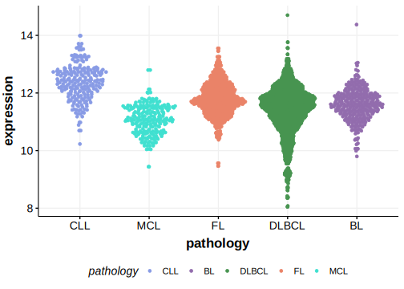

[[_TOC_]]

## Overview
KMT2D (also known as MLL2) encodes a histone H3K4 methyltransferase, playing a crucial role in germinal center B cell development and function. 
Mutations in KMT2D are among the most common mutations in FL and are also common in DLBCL.[@morinFrequentMutationHistonemodifying2011]
 KMT2D mutations are recurrent but less common in BL and MCL and many other B-cell neoplasms. Mutations typically cause loss of KMT2D function, leading to diminished H3K4 methylation, impacting gene expression that favours lymphomagenesis. 
 KMT2D mutations are associated with poor prognosis in DLBCL.[@deschGenotypingCirculatingTumor2020; @morinFrequentMutationHistonemodifying2011]

First identified as mutated in DLBCL and FL in 2011 by Morin et al.[@morinFrequentMutationHistonemodifying2011]
Mutations were later described in MCL in 2013 by Bea et al.[@beaLandscapeSomaticMutations2013] KMT2D mutations were later reported in BL by Grande et al.[@grandeGenomewideDiscoverySomatic2019]

## Experimental Evidence

Driver mutations affecting this gene in BL/DLBCL/FL have been experimentally demonstrated to cause a reduction or loss of function (LOF).[@zhangDisruptionKMT2DPerturbs2015]

## Relevance tier by entity

[[include:table1_KMT2D]]

## Mutation incidence in large patient cohorts (GAMBL reanalysis)

### DLBCL
[[include:DLBCL_KMT2D.md]]

### FL
[[include:FL_KMT2D.md]]

### BL
[[include:BL_KMT2D.md]]

## Mutation pattern and selective pressure estimates

[[include:dnds_KMT2D.md]]

[[include:browser_KMT2D.md]]

## Expression

[[include:mermaid_KMT2D.md]]

## References

<!-- ORIGIN: morinFrequentMutationHistonemodifying2011 -->
<!-- FL: morinFrequentMutationHistonemodifying2011 -->
<!-- BL: grandeGenomewideDiscoverySomatic2019 -->
<!-- BL: grandeGenomewideDiscoverySomatic2019 -->
<!-- DLBCL: morinFrequentMutationHistonemodifying2011 -->
<!-- MCL: beaLandscapeSomaticMutations2013 -->
<!-- MZL: rossiCodingGenomeSplenic2012c -->
 <!-- PMBL: deschGenotypingCirculatingTumor2020 -->
