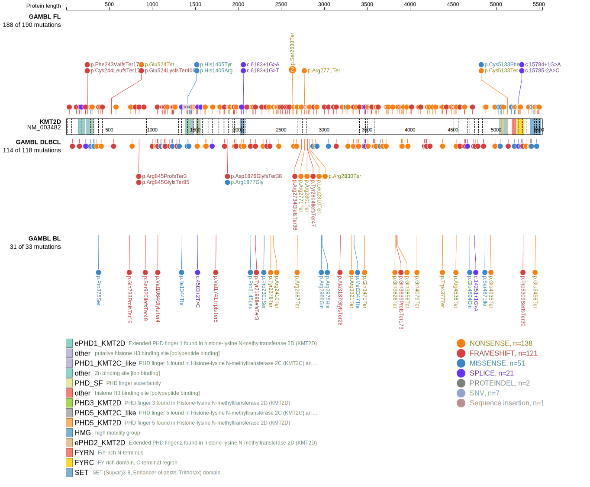
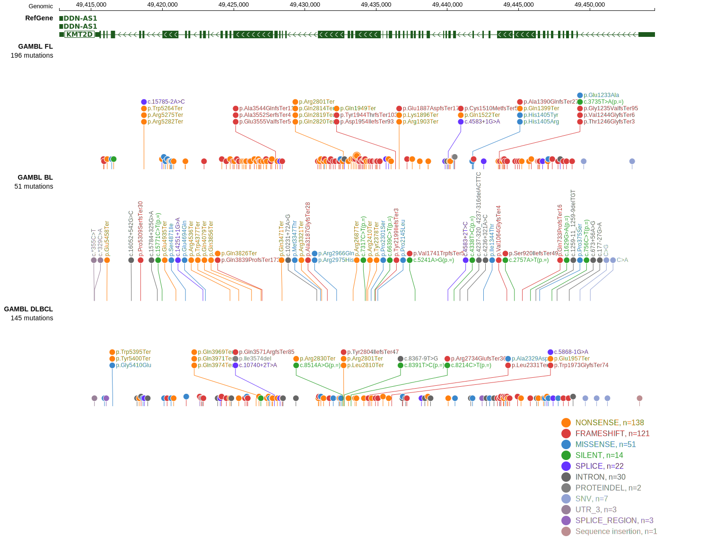

# [KMT2D]

## Mutation tier

|Entity|Tier|Description               |
|:------:|:----:|--------------------------|
|BL    |1   |high-confidence BL gene   |
|DLBCL |1   |high-confidence DLBCL gene|
|FL    |1   |high-confidence FL gene   |
## Mutation incidence

|Entity|source               |frequency (%)|
|:------:|:---------------------:|:-------------:|
|BL    |GAMBL genomes+capture|11.32        |
|BL    |Thomas cohort        |14.00        |
|BL    |Panea cohort         |15.80        |
|DLBCL |GAMBL genomes        |33.46        |
|DLBCL |Schmitz cohort       |34.50        |
|DLBCL |Reddy cohort         |22.30        |
|DLBCL |Chapuy cohort        |26.10        |
|FL    |GAMBL genomes        |67.67        |

## Mutation pattern

|Entity|aSHM|Significant selection|dN/dS (missense)|dN/dS (nonsense)|
|:------:|:----:|:---------------------:|:----------------:|:----------------:|
|BL    |No  |Yes                  | 0.689          |  13.459        |
|DLBCL |No  |Yes                  | 3.731          | 104.190        |
|FL    |No  |Yes                  |20.755          |1353.812        |

> [!NOTE]
> First described in BL in 2019 by [Grande BM](https://pubmed.ncbi.nlm.nih.gov/30617194). First described in DLBCL in 2011 by [Morin RD](https://pubmed.ncbi.nlm.nih.gov/21796119). First described in FL in 2011 by [Morin RD](https://pubmed.ncbi.nlm.nih.gov/21796119)

 ## KMT2D Hotspots

| Chromosome |Coordinate (hg19) | ref>alt | HGVSp | 
 | :---:| :---: | :--: | :---: |
| chr12 | 49433521 | C>A | E2678* |
| chr12 | 49433397 | G>A | Q2684* |
| chr12 | 49433394 | G>A | R2685* |
| chr12 | 49433388 | G>A | R2687* |
| chr12 | 49432710 | A>T | L2810* |
| chr12 | 49432699 | G>A | Q2814* |
| chr12 | 49432684 | G>A | Q2819* |
| chr12 | 49432681 | G>A | Q2820* |
| chr12 | 49424741 | G>A | R4536* |
| chr12 | 49420607 | G>A | R5048C |
| chr12 | 49420606 | C>T | R5048H |
| chr12 | 49420493 | G>A | R5086* |
| chr12 | 49420214 | G>A | R5179C |
| chr12 | 49420213 | C>T | R5179H |
| chr12 | 49420115 | C>G | A5212P |
| chr12 | 49420108 | C>T | R5214H |

View coding variants in ProteinPaint [hg19](https://www.bcgsc.ca/downloads/morinlab/GAMBL/test/genes/KMT2D_protein.html)  or [hg38](https://www.bcgsc.ca/downloads/morinlab/GAMBL/test/genes/KMT2D_protein_hg38.html)

View all variants in GenomePaint [hg19](https://www.bcgsc.ca/downloads/morinlab/GAMBL/test/genes/KMT2D.html)  or [hg38](https://www.bcgsc.ca/downloads/morinlab/GAMBL/test/genes/KMT2D_hg38.html)

