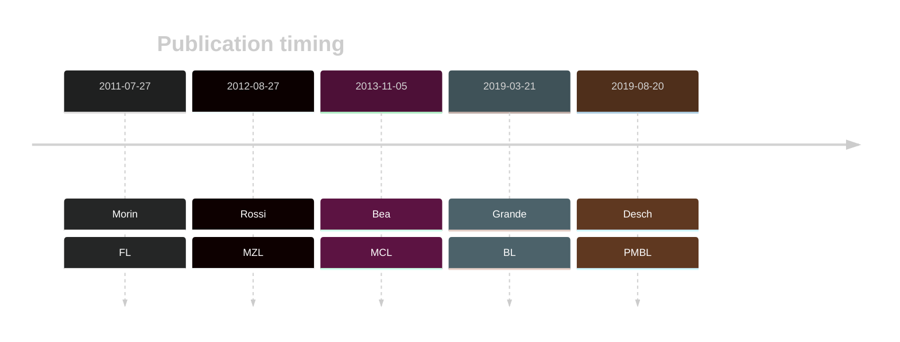

# KMT2D

## Overview
KMT2D (also known as MLL2) encodes a histone H3K4 methyltransferase, playing a crucial role in germinal center B cell development and function. 
Mutations in KMT2D are among the most common mutations in FL and are also common in DLBCL.1
 KMT2D mutations are recurrent but less common in BL and MCL and many other B-cell neoplasms. Mutations typically cause loss of KMT2D function, leading to diminished H3K4 methylation, impacting gene expression that favours lymphomagenesis. 
 KMT2D mutations are associated with poor prognosis in DLBCL.2,3

## History
First identified as mutated in DLBCL and FL in 2011 by Morin et al.1
Mutations were later described in MCL in 2013 by Bea et al.4 KMT2D mutations were later reported in BL by Grande et al.5

## Relevance tier by entity

|Entity|Tier|Description               |
|:------:|:----:|--------------------------|
||1|high-confidence MZL gene[@rossiCodingGenomeSplenic2012c]|
||2|relevance in PMBL/cHL/GZL not firmly established[@deschGenotypingCirculatingTumor2020]|
|    |1   |high-confidence FL gene   [@morinFrequentMutationHistonemodifying2011]|
| |1   |high-confidence DLBCL gene[@morinFrequentMutationHistonemodifying2011]|
|    |1   |high-confidence BL gene   [@grandeGenomewideDiscoverySomatic2019]|
|   |1   |high-confidence MCL gene  [@beaLandscapeSomaticMutations2013]|

## Mutation incidence in large patient cohorts (GAMBL reanalysis)

|Entity|source               |frequency (%)|
|:------:|:---------------------:|:-------------:|
|FL    |GAMBL genomes        |67.67        |
|DLBCL |GAMBL genomes        |33.46        |
|DLBCL |Schmitz cohort       |34.47        |
|DLBCL |Reddy cohort         |22.32        |
|DLBCL |Chapuy cohort        |26.07        |
|BL    |GAMBL genomes+capture|11.32        |
|BL    |Thomas cohort        |14.00        |
|BL    |Panea cohort         |15.80        |
|MCL   |GAMBL genomes        |16.59        |

## Mutation pattern and selective pressure estimates

|Entity|aSHM|Significant selection|dN/dS (missense)|dN/dS (nonsense)|
|:------:|:----:|:---------------------:|:----------------:|:----------------:|
|BL    |No  |Yes                  | 0.689          |  13.459        |
|DLBCL |No  |Yes                  | 3.731          | 104.190        |
|FL    |No  |Yes                  |20.755          |1353.812        |

View coding variants in ProteinPaint [hg19](https://morinlab.github.io/LLMPP/GAMBL/KMT2D_protein.html)  or [hg38](https://morinlab.github.io/LLMPP/GAMBL/KMT2D_protein_hg38.html)

View all variants in GenomePaint [hg19](https://morinlab.github.io/LLMPP/GAMBL/KMT2D.html)  or [hg38](https://morinlab.github.io/LLMPP/GAMBL/KMT2D_hg38.html)

## KMT2D Expression

## References

<!-- ORIGIN: morinFrequentMutationHistonemodifying2011 -->
<!-- FL: morinFrequentMutationHistonemodifying2011 -->
<!-- BL: grandeGenomewideDiscoverySomatic2019 -->
<!-- BL: grandeGenomewideDiscoverySomatic2019 -->
<!-- DLBCL: morinFrequentMutationHistonemodifying2011 -->
<!-- MCL: beaLandscapeSomaticMutations2013 -->
<!-- MZL: rossiCodingGenomeSplenic2012c -->
 <!-- PMBL: deschGenotypingCirculatingTumor2020 -->
