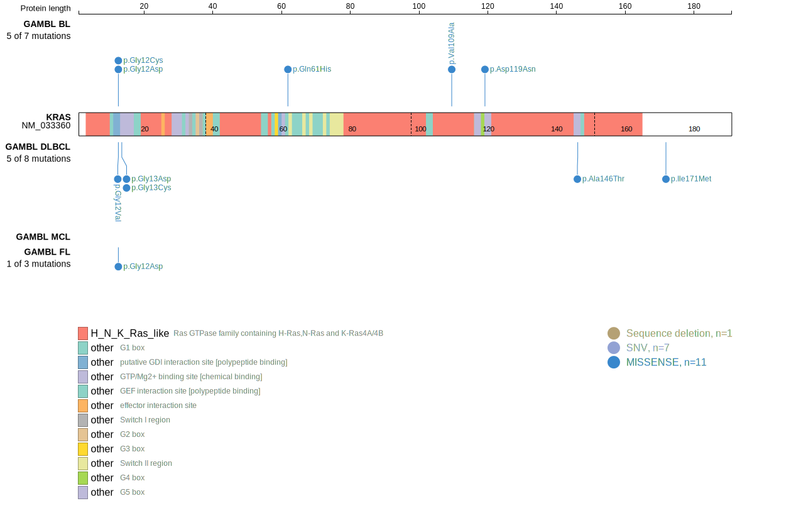
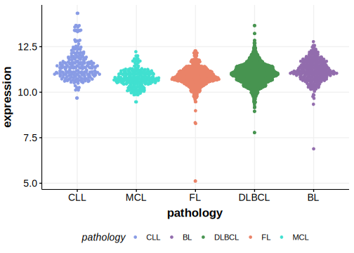

# KRAS
## Overview
KRAS mutations are rare but occur in some cases of DLBCL.1 These often affect the most common KRAS hotspot sites that are mutated in other solid cancers (G12 and G13).

## Relevance tier by entity

|Entity|Tier|Description               |
|:------:|:----:|--------------------------|
|DLBCL |1   |high-confidence DLBCL gene|

## Mutation incidence in large patient cohorts (GAMBL reanalysis)

|Entity|source        |frequency (%)|
|:------:|:--------------:|:-------------:|
|DLBCL |GAMBL genomes |1.91         |
|DLBCL |Schmitz cohort|3.62         |
|DLBCL |Reddy cohort  |1.70         |
|DLBCL |Chapuy cohort |2.56         |

## Mutation pattern and selective pressure estimates

|Entity|aSHM|Significant selection|dN/dS (missense)|dN/dS (nonsense)|
|:------:|:----:|:---------------------:|:----------------:|:----------------:|
|BL    |No  |No                   |27.314          |0               |
|DLBCL |No  |No                   | 5.336          |0               |
|FL    |No  |No                   | 9.959          |0               |

> [!NOTE]
> First described in DLBCL in 2012 by [Lohr JG](https://pubmed.ncbi.nlm.nih.gov/22343534)

 ## KRAS Hotspots

| Chromosome |Coordinate (hg19) | ref>alt | HGVSp | 
 | :---:| :---: | :--: | :---: |
| chr12 | 25398285 | C>A | G12C |
| chr12 | 25398284 | C>T | G12D |
| chr12 | 25398284 | C>A | G12V |
| chr12 | 25398282 | C>A | G13C |
| chr12 | 25398281 | C>T | G13D |

View coding variants in ProteinPaint [hg19](https://morinlab.github.io/LLMPP/GAMBL/KRAS_protein.html)  or [hg38](https://morinlab.github.io/LLMPP/GAMBL/KRAS_protein_hg38.html)

View all variants in GenomePaint [hg19](https://morinlab.github.io/LLMPP/GAMBL/KRAS.html)  or [hg38](https://morinlab.github.io/LLMPP/GAMBL/KRAS_hg38.html)

## KRAS Expression

## References
1. *Lohr JG, Stojanov P, Lawrence MS, Auclair D, Chapuy B, Sougnez C, Cruz-Gordillo P, Knoechel B, Asmann YW, Slager SL, Novak AJ, Dogan A, Ansell SM, Link BK, Zou L, Gould J, Saksena G, Stransky N, Rangel-Escareño C, Fernandez-Lopez JC, Hidalgo-Miranda A, Melendez-Zajgla J, Hernández-Lemus E, Schwarz-Cruz y Celis A, Imaz-Rosshandler I, Ojesina AI, Jung J, Pedamallu CS, Lander ES, Habermann TM, Cerhan JR, Shipp MA, Getz G, Golub TR. Discovery and prioritization of somatic mutations in diffuse large B-cell lymphoma (DLBCL) by whole-exome sequencing. Proc Natl Acad Sci U S A. 2012 Mar 6;109(10):3879-84. doi: 10.1073/pnas.1121343109. Epub 2012 Feb 17. PMID: 22343534; PMCID: PMC3309757.*

<!-- ORIGIN: lohrDiscoveryPrioritizationSomatic2012a -->
<!-- DLBCL: lohrDiscoveryPrioritizationSomatic2012a -->
