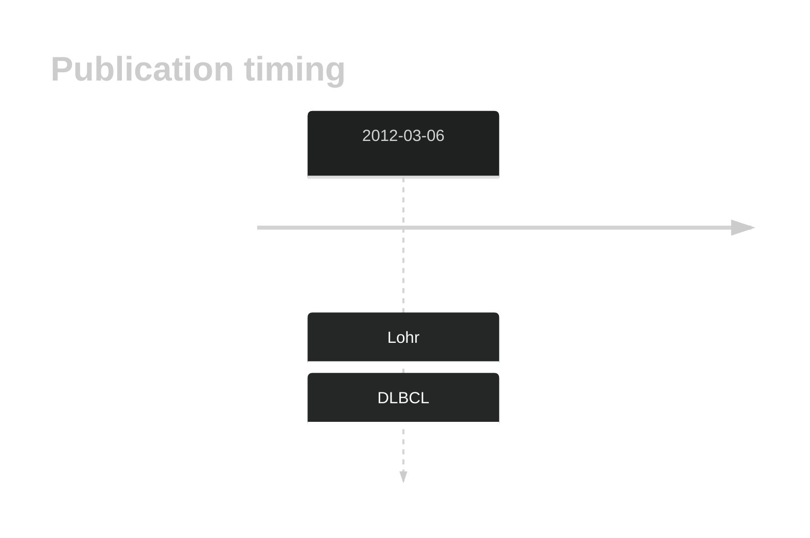

# KRAS

## Overview
KRAS mutations are rare but occur in some cases of DLBCL.1 These often affect the most common KRAS hotspot sites that are mutated in other solid cancers (G12 and G13).

## History

## Relevance tier by entity

|Entity|Tier|Description               |
|:------:|:----:|--------------------------|
| |1   |high-confidence DLBCL gene[@lohrDiscoveryPrioritizationSomatic2012]|

## Mutation incidence in large patient cohorts (GAMBL reanalysis)

[[include:DLBCL_KRAS.md]]

## Mutation pattern and selective pressure estimates

[[include:dnds_KRAS.md]]

## KRAS Hotspots

| Chromosome |Coordinate (hg19) | ref>alt | HGVSp | 
 | :---:| :---: | :--: | :---: |
| chr12 | 25398285 | C>A | G12C |
| chr12 | 25398284 | C>T | G12D |
| chr12 | 25398284 | C>A | G12V |
| chr12 | 25398282 | C>A | G13C |
| chr12 | 25398281 | C>T | G13D |

View coding variants in ProteinPaint [hg19](https://morinlab.github.io/LLMPP/GAMBL/KRAS_protein.html)  or [hg38](https://morinlab.github.io/LLMPP/GAMBL/KRAS_protein_hg38.html)

View all variants in GenomePaint [hg19](https://morinlab.github.io/LLMPP/GAMBL/KRAS.html)  or [hg38](https://morinlab.github.io/LLMPP/GAMBL/KRAS_hg38.html)

## KRAS Expression

## References

<!-- ORIGIN: lohrDiscoveryPrioritizationSomatic2012a -->
<!-- DLBCL: lohrDiscoveryPrioritizationSomatic2012a -->
