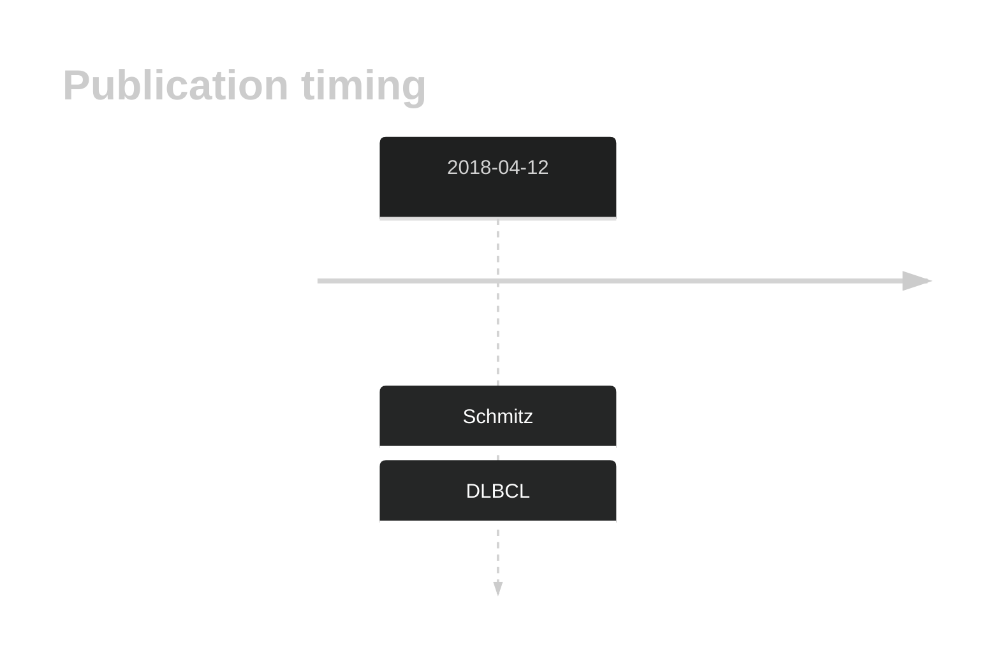
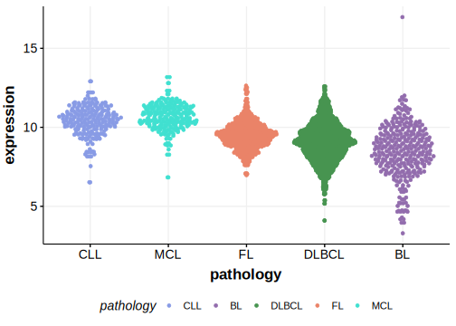

# LAMA5

## History

## Relevance tier by entity

|Entity|Tier|Description                              |
|:------:|:----:|-----------------------------------------|
| |2   |relevance in DLBCL not firmly established|

## Mutation incidence in large patient cohorts (GAMBL reanalysis)

|Entity|source        |frequency (%)|
|:------:|:--------------:|:-------------:|
|DLBCL |GAMBL genomes | 3.44        |
|DLBCL |Schmitz cohort|12.13        |
|DLBCL |Reddy cohort  | 4.70        |
|DLBCL |Chapuy cohort | 5.56        |

## Mutation pattern and selective pressure estimates

|Entity|aSHM|Significant selection|dN/dS (missense)|dN/dS (nonsense)|
|:------:|:----:|:---------------------:|:----------------:|:----------------:|
|BL    |No  |No                   |0.000           |0.000           |
|DLBCL |No  |No                   |2.765           |4.134           |
|FL    |No  |No                   |0.000           |0.000           |

View coding variants in ProteinPaint [hg19](https://morinlab.github.io/LLMPP/GAMBL/LAMA5_protein.html)  or [hg38](https://morinlab.github.io/LLMPP/GAMBL/LAMA5_protein_hg38.html)

View all variants in GenomePaint [hg19](https://morinlab.github.io/LLMPP/GAMBL/LAMA5.html)  or [hg38](https://morinlab.github.io/LLMPP/GAMBL/LAMA5_hg38.html)

## LAMA5 Expression

<!-- ORIGIN: schmitzGeneticsPathogenesisDiffuse2018a -->
<!-- DLBCL: schmitzGeneticsPathogenesisDiffuse2018a -->

## References
1.  Schmitz R, Wright GW, Huang DW, Johnson CA, Phelan JD, Wang JQ, Roulland S, Kasbekar M, Young RM, Shaffer AL, Hodson DJ, Xiao W, Yu X, Yang Y, Zhao H, Xu W, Liu X, Zhou B, Du W, Chan WC, Jaffe ES, Gascoyne RD, Connors JM, Campo E, Lopez-Guillermo A, Rosenwald A, Ott G, Delabie J, Rimsza LM, Tay Kuang Wei K, Zelenetz AD, Leonard JP, Bartlett NL, Tran B, Shetty J, Zhao Y, Soppet DR, Pittaluga S, Wilson WH, Staudt LM. Genetics and Pathogenesis of Diffuse Large B-Cell Lymphoma. N Engl J Med. 2018 Apr 12;378(15):1396–1407. PMCID: PMC6010183
