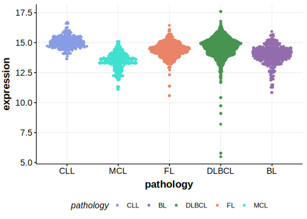

[[_TOC_]]

## Overview

Mutations in this gene were first described in DLBCL and FL in 2021 by Hübschmann et al.[@hubschmannMutationalMechanismsShaping2021]

## Relevance tier by entity

[[include:table1_LAPTM5.md]]

## Mutation incidence in large patient cohorts (GAMBL reanalysis)

|Entity|source        |frequency (%)|
|:------:|:--------------:|:-------------:|
|DLBCL |GAMBL genomes |3.06         |
|DLBCL |Schmitz cohort|3.40         |
|DLBCL |Reddy cohort  |2.20         |
|DLBCL |Chapuy cohort |2.56         |
|FL    |GAMBL genomes |5.77         |

## Mutation pattern and selective pressure estimates

[[include:dnds_LAPTM5.md]]

## aSHM regions

|chr_name|hg19_start|hg19_end|region                                                                                   |regulatory_comment|
|:--------:|:----------:|:--------:|:-----------------------------------------------------------------------------------------:|:------------------:|
|chr1    |31229012  |31232011|[TSS](https://genome.ucsc.edu/s/rdmorin/GAMBL%20hg19?position=chr1%3A31229012%2D31232011)|NA                |

[[include:browser_LAPTM5.md]]

## Expression

## All Mutations

[SP194065](https://www.bcgsc.ca/downloads/morinlab/GAMBL/MALY/SP194065.html)
[SP116642](https://www.bcgsc.ca/downloads/morinlab/GAMBL/MALY/SP116642.html)
[SP194216](https://www.bcgsc.ca/downloads/morinlab/GAMBL/MALY/SP194216.html)
[SP193040](https://www.bcgsc.ca/downloads/morinlab/GAMBL/MALY/SP193040.html)
[SP193656](https://www.bcgsc.ca/downloads/morinlab/GAMBL/MALY/SP193656.html)
[SP116709](https://www.bcgsc.ca/downloads/morinlab/GAMBL/MALY/SP116709.html)

[[include:mermaid_LAPTM5.md]]

## References

<!-- ORIGIN: hubschmannMutationalMechanismsShaping2021b -->
<!-- FL: hubschmannMutationalMechanismsShaping2021b -->
