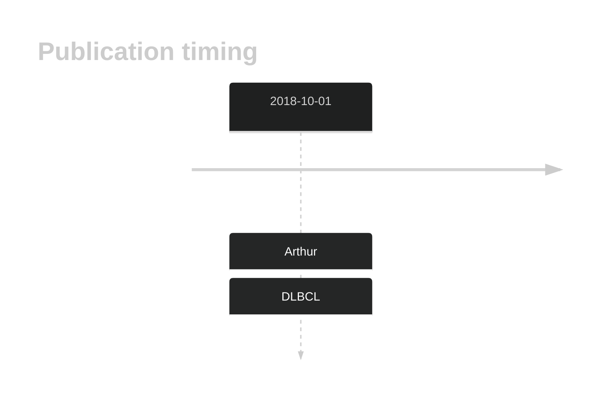
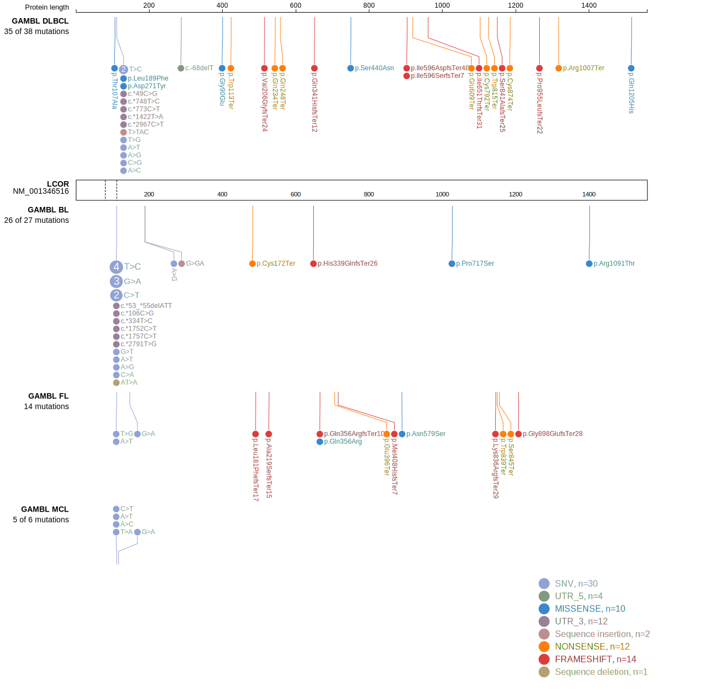
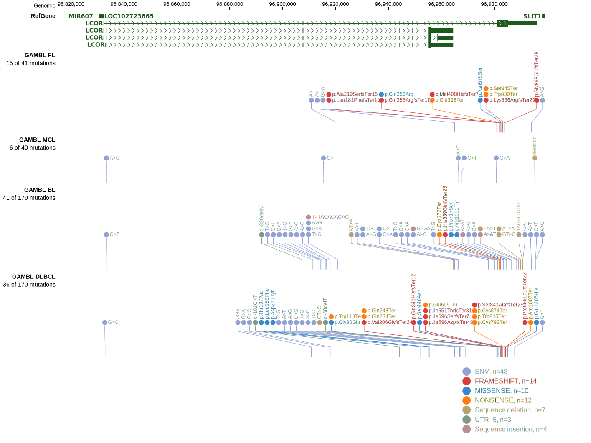
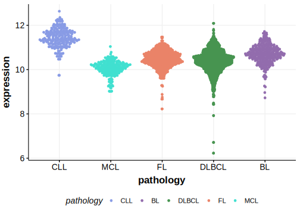

# LCOR

## Overview
LCOR (Ligand Dependent Nuclear Receptor Corepressor) is involved in the regulation of gene expression by acting as a corepressor for various nuclear receptors and transcription factors. It influences chromatin structure and gene transcription, which can impact cell growth and differentiation. Although recurrently mutated in DLBCL, owing to different annotations of this gene and C10orf12 in hg19 and hg38, there is some confusion about the mutation rate. 

## History

## Relevance tier by entity

|Entity|Tier|Description                           |
|:------:|:----:|--------------------------------------|
| |1   |high-confidence DLBCL gene            [@arthurGenomewideDiscoverySomatic2018]|
|    |2   |relevance in BL not firmly established|

## Mutation incidence in large patient cohorts (GAMBL reanalysis)

|Entity|source               |frequency (%)|
|:------:|:---------------------:|:-------------:|
|DLBCL |GAMBL genomes        |6.31         |
|DLBCL |Schmitz cohort       |0.43         |
|DLBCL |Reddy cohort         |0.50         |
|DLBCL |Chapuy cohort        |0.43         |
|BL    |GAMBL genomes+capture|3.46         |
|BL    |Thomas cohort        |0.00         |
|BL    |Panea cohort         |  NA         |

## Mutation pattern and selective pressure estimates

|Entity|aSHM|Significant selection|dN/dS (missense)|dN/dS (nonsense)|
|:------:|:----:|:---------------------:|:----------------:|:----------------:|
|BL    |No  |No                   |0               |0               |
|DLBCL |No  |No                   |0               |0               |
|FL    |No  |No                   |0               |0               |

View coding variants in ProteinPaint [hg19](https://morinlab.github.io/LLMPP/GAMBL/LCOR_protein.html)  or [hg38](https://morinlab.github.io/LLMPP/GAMBL/LCOR_protein_hg38.html)

View all variants in GenomePaint [hg19](https://morinlab.github.io/LLMPP/GAMBL/LCOR.html)  or [hg38](https://morinlab.github.io/LLMPP/GAMBL/LCOR_hg38.html)

## LCOR Expression

<!-- ORIGIN: 30275490 -->
<!-- BL: 2 -->
<!-- DLBCL: arthurGenomewideDiscoverySomatic2018 -->

## References
