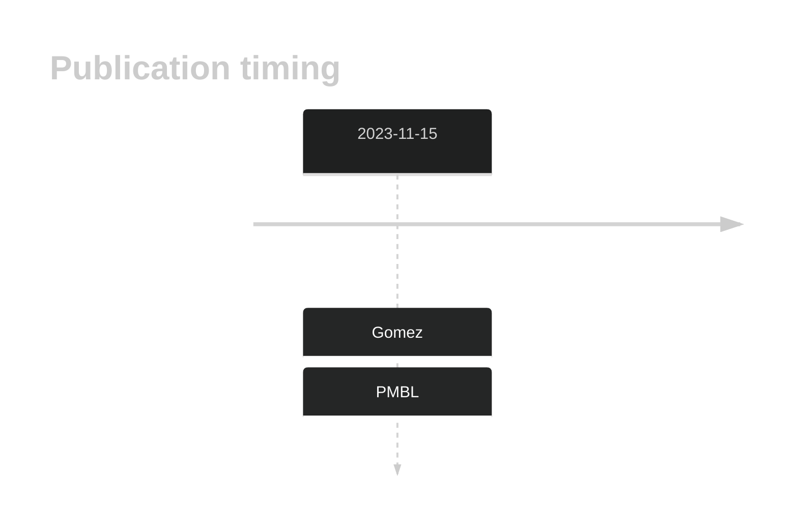

# LIMD2

## History

## Relevance tier by entity

|Entity|Tier|Description|
|:------:|:----:|--------------------------------------|
||2|relevance in PMBL/cHL/GZL not firmly established[@gomezUltraDeepSequencingReveals2023]|

## Mutation incidence in large patient cohorts (GAMBL reanalysis)

|Entity|source |frequency (%)|
|:------:|:----:|:----:|
|BL|GAMBL Exome |0.575 |
|BL|GAMBL Genome |0.386 |
|DLBCL|GAMBL Exome |1.24 |
|DLBCL|GAMBL Genome |1.316 |

## References

