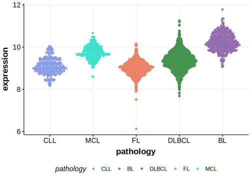

[[_TOC_]]

## Relevance tier by entity

[[include:table1_LIN54.md]]

## Warnings

<<Warn("The variants reported in this gene in DLBCL failed QC")>>

## Mutation incidence in large patient cohorts (GAMBL reanalysis)

|Entity|source        |frequency (%)|
|:------:|:--------------:|:-------------:|
|DLBCL |GAMBL genomes |0.57         |
|DLBCL |Schmitz cohort|2.13         |
|DLBCL |Reddy cohort  |0.90         |
|DLBCL |Chapuy cohort |0.85         |

## Mutation pattern and selective pressure estimates

[[include:dnds_LIN54.md]]

[[include:browser_LIN54.md]]

## Expression

<!-- ORIGIN: reddyGeneticFunctionalDrivers2017 -->
<!-- DLBCL: reddyGeneticFunctionalDrivers2017 -->

## All Mutations

[Reddy_2164T](https://www.bcgsc.ca/downloads/morinlab/GAMBL/Reddy/igv_reports/Reddy_2164T.html)
[Reddy_2225T](https://www.bcgsc.ca/downloads/morinlab/GAMBL/Reddy/igv_reports/Reddy_2225T.html)
[Reddy_2473T](https://www.bcgsc.ca/downloads/morinlab/GAMBL/Reddy/igv_reports/Reddy_2473T.html)
[Reddy_2634T](https://www.bcgsc.ca/downloads/morinlab/GAMBL/Reddy/igv_reports/Reddy_2634T.html)
[Reddy_2768T](https://www.bcgsc.ca/downloads/morinlab/GAMBL/Reddy/igv_reports/Reddy_2768T.html)
[Reddy_2899T](https://www.bcgsc.ca/downloads/morinlab/GAMBL/Reddy/igv_reports/Reddy_2899T.html)
[Reddy_3403T](https://www.bcgsc.ca/downloads/morinlab/GAMBL/Reddy/igv_reports/Reddy_3403T.html)
[Reddy_3419T](https://www.bcgsc.ca/downloads/morinlab/GAMBL/Reddy/igv_reports/Reddy_3419T.html)
[Reddy_3493T](https://www.bcgsc.ca/downloads/morinlab/GAMBL/Reddy/igv_reports/Reddy_3493T.html)
[Reddy_3608T](https://www.bcgsc.ca/downloads/morinlab/GAMBL/Reddy/igv_reports/Reddy_3608T.html)
[Reddy_3636T](https://www.bcgsc.ca/downloads/morinlab/GAMBL/Reddy/igv_reports/Reddy_3636T.html)
[Reddy_3813T](https://www.bcgsc.ca/downloads/morinlab/GAMBL/Reddy/igv_reports/Reddy_3813T.html)
[Reddy_3827T](https://www.bcgsc.ca/downloads/morinlab/GAMBL/Reddy/igv_reports/Reddy_3827T.html)
[Reddy_4000T](https://www.bcgsc.ca/downloads/morinlab/GAMBL/Reddy/igv_reports/Reddy_4000T.html)

[[include:mermaid_LIN54.md]]

## References
[@reddyGeneticFunctionalDrivers2017]
