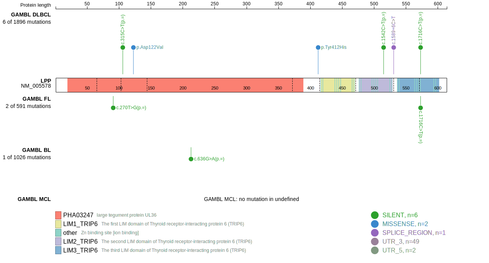
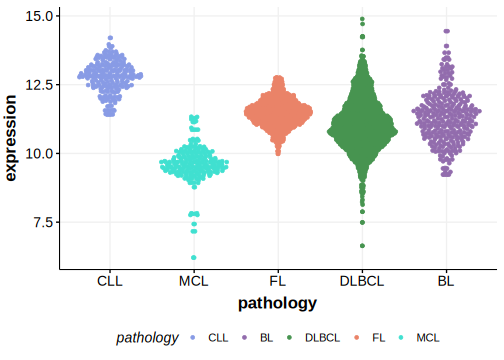

[[_TOC_]]

## Relevance tier by entity

|Entity|Tier|Description                              |
|:------:|:----:|-----------------------------------------|
| |2 | aSHM target; Although recurrent, the relevance of mutations in DLBCL is tenuous [@arthurGenomewideDiscoverySomatic2018]|

## Mutation incidence in large patient cohorts (GAMBL reanalysis)

|Entity|source        |frequency (%)|
|:------:|:--------------:|:-------------:|
|DLBCL |GAMBL genomes |1.15         |
|DLBCL |Schmitz cohort|1.28         |
|DLBCL |Reddy cohort  |1.30         |
|DLBCL |Chapuy cohort |0.85         |

## Mutation pattern and selective pressure estimates

|Entity|aSHM|Significant selection|dN/dS (missense)|dN/dS (nonsense)|
|:------:|:----:|:---------------------:|:----------------:|:----------------:|
|BL    |Yes |No                   |0               |0               |
|DLBCL |Yes |No                   |0               |0               |
|FL    |Yes |No                   |0               |0               |

## aSHM regions

|chr_name|hg19_start|hg19_end |region                                                                                          |regulatory_comment|
|:--------:|:----------:|:---------:|:------------------------------------------------------------------------------------------------:|:------------------:|
|chr3    |187771678 |187801626|[TSS-1](https://genome.ucsc.edu/s/rdmorin/GAMBL%20hg19?position=chr3%3A187771678%2D187801626)   |NA                |
|chr3    |187801627 |187813568|[TSS-2](https://genome.ucsc.edu/s/rdmorin/GAMBL%20hg19?position=chr3%3A187801627%2D187813568)   |NA                |
|chr3    |187813569 |187955254|[TSS-3](https://genome.ucsc.edu/s/rdmorin/GAMBL%20hg19?position=chr3%3A187813569%2D187955254)   |NA                |
|chr3    |187955255 |187969220|[TSS-4](https://genome.ucsc.edu/s/rdmorin/GAMBL%20hg19?position=chr3%3A187955255%2D187969220)   |NA                |
|chr3    |188261523 |188327097|[TSS-5](https://genome.ucsc.edu/s/rdmorin/GAMBL%20hg19?position=chr3%3A188261523%2D188327097)   |NA                |
|chr3    |188377178 |188401951|[intron-1](https://genome.ucsc.edu/s/rdmorin/GAMBL%20hg19?position=chr3%3A188377178%2D188401951)|NA                |
|chr3    |188401952 |188461879|[intron-2](https://genome.ucsc.edu/s/rdmorin/GAMBL%20hg19?position=chr3%3A188401952%2D188461879)|NA                |
|chr3    |188461880 |188474683|[intron-3](https://genome.ucsc.edu/s/rdmorin/GAMBL%20hg19?position=chr3%3A188461880%2D188474683)|NA                |
|chr3    |188474684 |188491248|[intron-4](https://genome.ucsc.edu/s/rdmorin/GAMBL%20hg19?position=chr3%3A188474684%2D188491248)|NA                |

View coding variants in ProteinPaint [hg19](https://morinlab.github.io/LLMPP/GAMBL/LPP_protein.html)  or [hg38](https://morinlab.github.io/LLMPP/GAMBL/LPP_protein_hg38.html)

View all variants in GenomePaint [hg19](https://morinlab.github.io/LLMPP/GAMBL/LPP.html)  or [hg38](https://morinlab.github.io/LLMPP/GAMBL/LPP_hg38.html)

## LPP Expression

<!-- ORIGIN: arthurGenomewideDiscoverySomatic2018 -->
<!-- DLBCL: arthurGenomewideDiscoverySomatic2018 -->

[[include:mermaid_LPP.md]]

## References
