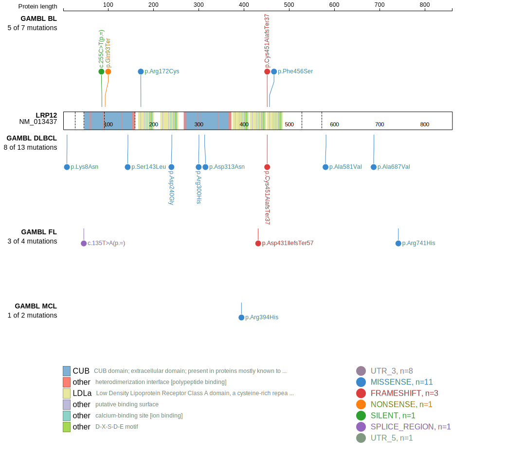
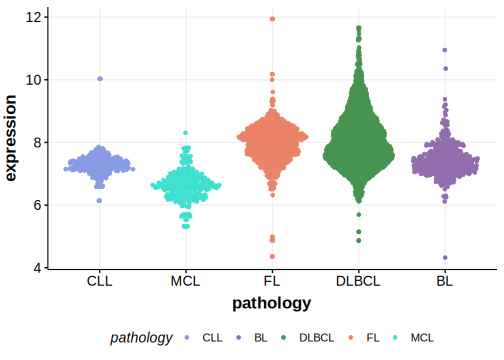

[[_TOC_]]

Mutations in this gene were first described in DLBCL in 2021 by Hübschmann et al.1

## Relevance tier by entity

|Entity|Tier|Description                              |
|:------:|:----:|-----------------------------------------|
| |2   |relevance in DLBCL not firmly established[@hubschmannMutationalMechanismsShaping2021]|

## Mutation incidence in large patient cohorts (GAMBL reanalysis)

|Entity|source        |frequency (%)|
|:------:|:--------------:|:-------------:|
|DLBCL |GAMBL genomes |2.49         |
|DLBCL |Schmitz cohort|2.34         |
|DLBCL |Reddy cohort  |2.40         |
|DLBCL |Chapuy cohort |2.56         |

## Mutation pattern and selective pressure estimates

[[include:dnds_LRP12.md]]

View coding variants in ProteinPaint [hg19](https://morinlab.github.io/LLMPP/GAMBL/LRP12_protein.html)  or [hg38](https://morinlab.github.io/LLMPP/GAMBL/LRP12_protein_hg38.html)

View all variants in GenomePaint [hg19](https://morinlab.github.io/LLMPP/GAMBL/LRP12.html)  or [hg38](https://morinlab.github.io/LLMPP/GAMBL/LRP12_hg38.html)

## LRP12 Expression

## All Mutations

[SP194077](https://www.bcgsc.ca/downloads/morinlab/GAMBL/MALY/SP194077.html)
[SP59460](https://www.bcgsc.ca/downloads/morinlab/GAMBL/MALY/SP59460.html)
[SP193258](https://www.bcgsc.ca/downloads/morinlab/GAMBL/MALY/SP193258.html)

[[include:mermaid_LRP12.md]]

## References

<!-- ORIGIN: hubschmannMutationalMechanismsShaping2021b -->
<!-- DLBCL: hubschmannMutationalMechanismsShaping2021b -->
