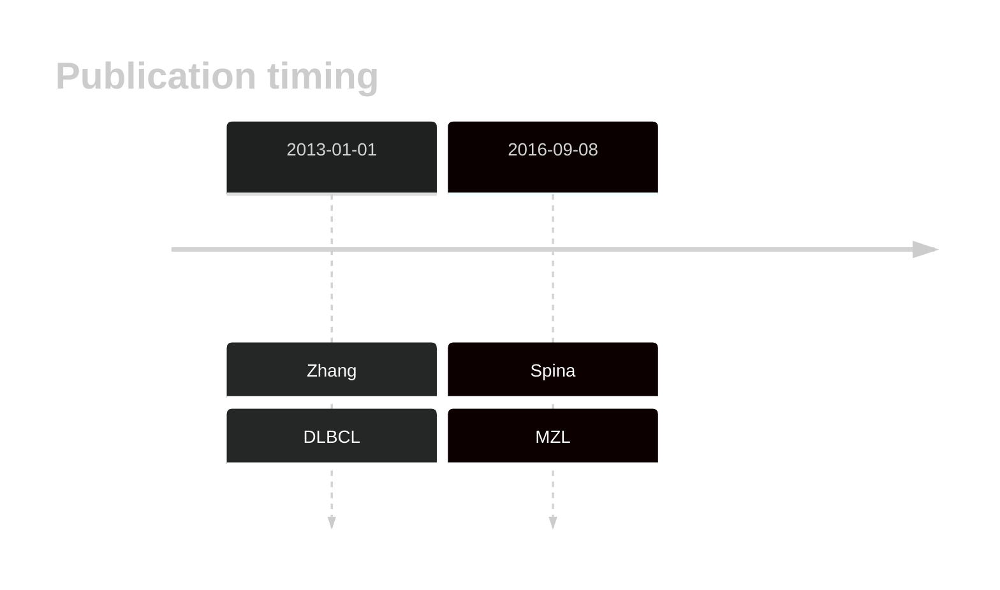

# LRP1B

## History

## Relevance tier by entity

|Entity|Tier|Description|
|:------:|:----:|--------------------------------------|
||2|relevance in MZL not firmly established[@spinaGeneticsNodalMarginal2016b]|

## Mutation incidence in large patient cohorts (GAMBL reanalysis)

|Entity|source |frequency (%)|
|:------:|:----:|:----:|
|BL|GAMBL Exome |12.069 |
|BL|GAMBL Genome |8.88 |
|DLBCL|GAMBL Exome |14.717 |
|DLBCL|GAMBL Genome |13.91 |
|FL|GAMBL Exome |6.017 |
|MCL|GAMBL Genome |5.848 |

## References

