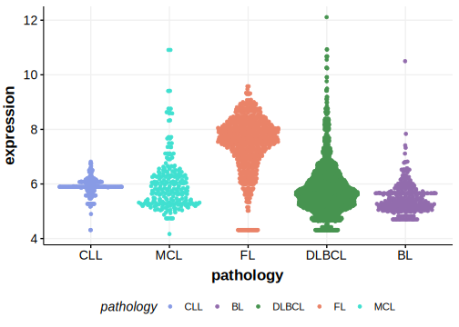

[[_TOC_]]

## Relevance tier by entity

[[include:table1_LRRN3.md]]

## Mutation incidence in large patient cohorts (GAMBL reanalysis)

[[include:tables/DLBCL_LRRN3.md]]

## Mutation pattern and selective pressure estimates

[[include:tables/dnds_LRRN3.md]]

[[include:browser_LRRN3.md]]

## Expression

<!-- ORIGIN: morinMutationalStructuralAnalysis2013 -->
<!-- DLBCL: morinMutationalStructuralAnalysis2013 -->
<!-- PMBL: sarkozyMutationalLandscapeGray2021a -->

## All Mutations

[RG051](https://www.bcgsc.ca/downloads/morinlab/GAMBL/Morin_2013/RG051.html)
[RG075](https://www.bcgsc.ca/downloads/morinlab/GAMBL/Morin_2013/RG075.html)
[RG111](https://www.bcgsc.ca/downloads/morinlab/GAMBL/Morin_2013/RG111.html)

[[include:mermaid_LRRN3.md]]

## References

